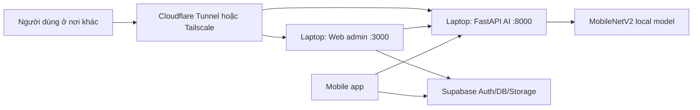

# Triển khai Eco-loop Campus trên laptop riêng

Tài liệu này dùng để biến một laptop không dùng thường xuyên thành server chạy web admin Eco-loop Campus và API AI FastAPI, để truy cập từ nơi khác.

## Kết luận nhanh

Không nên mở trực tiếp `npm start` hoặc `uvicorn --reload` ra Internet.

Khuyến nghị mặc định:

1. Public demo qua Internet: dùng Cloudflare Tunnel.
2. Chỉ cá nhân/team truy cập: dùng Tailscale.
3. Không khuyến nghị: port forwarding thẳng `3000` và `8000` từ router.

Supabase vẫn giữ là database/Auth chính. Laptop chỉ host:

- Web admin React build tĩnh tại `http://127.0.0.1:3000`.
- FastAPI AI backend tại `http://127.0.0.1:8000`.

## Sơ đồ đề xuất



## Chuẩn bị laptop server

Laptop nên có:

- Windows 10/11 đã cập nhật.
- RAM tối thiểu 8 GB, khuyến nghị 16 GB nếu chạy TensorFlow ổn định.
- Python 3.10.
- Node.js LTS.
- Git.
- Kết nối mạng ổn định.
- Tắt Sleep/Hibernate khi cắm sạc.

Thiết lập Windows:

1. Power Options: đặt `Sleep = Never` khi cắm sạc.
2. Windows Update: cập nhật đầy đủ.
3. Không lưu Supabase service role key trong frontend/mobile.
4. Đổi toàn bộ mật khẩu demo trước khi public.

## Script production đã có trong repo

Các script mới nằm tại:

- `scripts/start_backend_prod.bat`
- `scripts/start_web_prod.bat`
- `scripts/start_laptop_server.bat`
- `scripts/serve_cra_build.js`

Chạy cả web và API:

```powershell
cd /d "D:\Project\NỔ NỔ\Eco-loop-Campus"
scripts\start_laptop_server.bat
```

Chạy riêng backend:

```powershell
cd /d "D:\Project\NỔ NỔ\Eco-loop-Campus"
scripts\start_backend_prod.bat
```

Chạy riêng web:

```powershell
cd /d "D:\Project\NỔ NỔ\Eco-loop-Campus"
scripts\start_web_prod.bat
```

Kiểm tra local trên chính laptop:

```powershell
Invoke-WebRequest -UseBasicParsing http://127.0.0.1:8000/
Invoke-WebRequest -UseBasicParsing http://127.0.0.1:3000/
```

Kỳ vọng backend trả:

```json
{"message":"Eco-loop Campus Backend Running"}
```

## Cấu hình web admin gọi API public

Web admin dùng biến build-time của CRA:

```env
REACT_APP_API_URL=https://api.your-domain.example
```

Đặt biến này trong:

```text
frontend/eco-loop-campus-admin/.env.production.local
```

Ví dụ:

```env
REACT_APP_SUPABASE_URL=https://your-project.supabase.co
REACT_APP_SUPABASE_PUBLISHABLE_KEY=your-publishable-key
REACT_APP_API_URL=https://api.ecoloop.example.vn
```

Sau khi đổi `.env.production.local`, phải build lại web:

```powershell
cd /d "D:\Project\NỔ NỔ\Eco-loop-Campus\frontend\eco-loop-campus-admin"
npm run build
```

## Cấu hình backend CORS khi public

Backend đọc biến:

```env
CORS_ORIGINS=https://admin.ecoloop.example.vn
```

Nếu có nhiều origin:

```env
CORS_ORIGINS=https://admin.ecoloop.example.vn,https://preview.ecoloop.example.vn
```

Khi chạy bằng PowerShell:

```powershell
$env:CORS_ORIGINS="https://admin.ecoloop.example.vn"
scripts\start_backend_prod.bat
```

Khi chưa set, backend vẫn giữ cấu hình dev để không làm hỏng test local.

## Phương án 1: Cloudflare Tunnel cho public demo

Dùng khi muốn mở web/API qua Internet cho thầy cô, nhóm, hoặc demo ngoài mạng nhà.

Ưu điểm:

- Không cần mở port router.
- Không cần IP tĩnh.
- Có HTTPS.
- Dễ gắn domain/subdomain.

Luồng cấu hình:

1. Mua hoặc dùng domain đã đưa về Cloudflare.
2. Cài `cloudflared` trên laptop server.
3. Tạo tunnel trong Cloudflare Dashboard.
4. Thêm 2 published applications:

| Public hostname | Service URL local |
| --- | --- |
| `admin.ecoloop.example.vn` | `http://localhost:3000` |
| `api.ecoloop.example.vn` | `http://localhost:8000` |

5. Set frontend env:

```env
REACT_APP_API_URL=https://api.ecoloop.example.vn
```

6. Set backend CORS:

```powershell
$env:CORS_ORIGINS="https://admin.ecoloop.example.vn"
```

7. Chạy `scripts/start_laptop_server.bat`.
8. Mở `https://admin.ecoloop.example.vn` ở mạng khác để kiểm tra.

Nên bật Cloudflare Access nếu admin web không muốn public toàn bộ. Ít nhất hãy bảo vệ route admin bằng Supabase Auth và tài khoản admin thật.

Tài liệu chính thức:

- Cloudflare Tunnel overview: https://developers.cloudflare.com/tunnel/
- Cloudflare Tunnel setup: https://developers.cloudflare.com/tunnel/setup/
- Cloudflare Tunnel routing: https://developers.cloudflare.com/tunnel/routing/

## Phương án 2: Tailscale cho truy cập riêng tư

Dùng khi chỉ bạn hoặc nhóm nhỏ cần truy cập. Mỗi máy/điện thoại cần đăng nhập Tailscale cùng tailnet.

Ưu điểm:

- An toàn hơn public demo.
- Không cần domain.
- Không cần mở port router.

Cách đơn giản:

1. Cài Tailscale trên laptop server.
2. Cài Tailscale trên máy/điện thoại cần truy cập.
3. Đăng nhập cùng tài khoản/tailnet.
4. Chạy server local bằng `scripts/start_laptop_server.bat`.
5. Dùng Tailscale Serve để publish service trong tailnet:

```powershell
tailscale serve --bg --http=3000 localhost:3000
tailscale serve --bg --http=8000 localhost:8000
```

Sau đó truy cập theo MagicDNS hoặc Tailscale IP của laptop.

Tài liệu chính thức:

- Tailscale quickstart: https://tailscale.com/kb/1017/install
- Tailscale Serve: https://tailscale.com/kb/1242/tailscale-serve

## Phương án 3: Port forwarding router

Không khuyến nghị cho dự án này.

Chỉ dùng nếu bạn hiểu rõ:

- DDNS.
- HTTPS reverse proxy.
- Firewall inbound rules.
- Rate limit.
- Cách khóa admin/API trước bot scan Internet.

Tuyệt đối không forward thẳng:

- `localhost:3000` của CRA dev server.
- `localhost:8000` chạy `uvicorn --reload`.
- Supabase service role key hoặc endpoint debug nội bộ.

## Mobile app khi API đã public

Mobile dùng:

```env
EXPO_PUBLIC_API_URL=https://api.ecoloop.example.vn
```

Đặt trong:

```text
ecoloop-campus-mobile/ecoloop-campus-mobile/.env
```

Sau khi đổi env, restart Expo/Dev Client:

```powershell
npx expo start -c
```

Nếu dùng Android Emulator cục bộ thì vẫn có thể dùng:

```env
EXPO_PUBLIC_API_URL=http://10.0.2.2:8000
```

Nếu dùng điện thoại thật hoặc ở nơi khác, phải dùng domain tunnel/public API.

## Giảm tải server AI

Backend hiện load MobileNetV2 trong process FastAPI. Vì vậy:

- Script prod chạy `--workers 1` để tránh load model nhiều bản trong RAM.
- Không upload ảnh quá lớn từ mobile/web; client nên nén ảnh trước khi gửi.
- Giữ timeout mobile khoảng 15 giây.
- AI chỉ dùng để gợi ý/phân loại, không tự cộng điểm.
- Nếu nhiều người dùng thật, cân nhắc chuyển AI sang on-device hoặc máy có GPU/server cloud.
- Cloudflare có thể thêm rate limiting/WAF trước `/predict` nếu API public.

## Checklist bảo mật trước khi public

- Đổi mật khẩu demo `student`, `volunteer`, `admin`.
- Supabase RLS đã bật và policy đúng role.
- Không có service role key trong frontend/mobile `.env`.
- `CORS_ORIGINS` chỉ trỏ domain web thật.
- Cloudflare Access bật cho admin web nếu demo không cần public rộng.
- Windows Defender/Firewall bật.
- Laptop không chứa dữ liệu cá nhân không cần thiết.
- Tắt Sleep khi cắm sạc.
- Có lịch backup repo/model/schema.

## Kiểm tra cuối

Local laptop:

```powershell
Invoke-WebRequest -UseBasicParsing http://127.0.0.1:3000/
Invoke-WebRequest -UseBasicParsing http://127.0.0.1:8000/
```

Qua domain/tunnel:

```powershell
Invoke-WebRequest -UseBasicParsing https://admin.ecoloop.example.vn/
Invoke-WebRequest -UseBasicParsing https://api.ecoloop.example.vn/
```

Trong web admin:

- Đăng nhập admin.
- Vào `#/ai-test`.
- Kiểm tra dòng backend đang là domain API public.
- Upload ảnh test `/predict`.

Trong mobile:

- Đăng nhập student.
- Tạo giao dịch gửi rác.
- Test AI nếu đang dùng remote API.
- Đăng nhập volunteer.
- Quét/xử lý QR.

## Khuyến nghị triển khai cho dự án này

Nếu mục tiêu là mở được từ nơi khác để demo: chọn Cloudflare Tunnel.

Nếu mục tiêu là dùng riêng trong nhóm phát triển: chọn Tailscale.

Nếu sau này có người dùng thật thường xuyên: chuyển web admin lên hosting tĩnh, giữ Supabase managed, và cân nhắc tách AI backend sang VPS/GPU/on-device thay vì laptop cá nhân.
