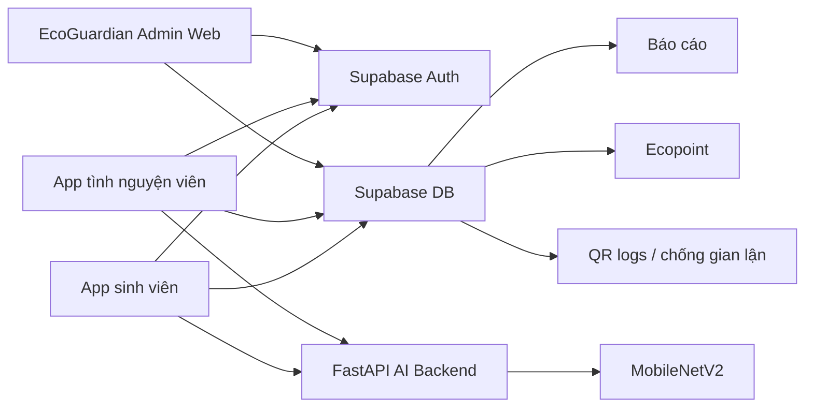

# Eco-loop Campus Mobile Handoff

Tài liệu này là bản bàn giao để triển khai app mobile theo hướng **Eco-loop Campus**. Project kỹ thuật hiện tại là EcoGuardian / Smart Waste Detection; web admin EcoGuardian sẽ là nền quản trị cho mô hình Eco-loop Campus.

Trọng tâm mới: app mobile không lấy AI làm luồng chính. Luồng chính là sinh viên gửi rác tái chế tại trạm, tạo QR giao dịch, tình nguyện viên xác nhận rác thật, hệ thống cộng Ecopoint tạm tính/chính thức, admin theo dõi và xuất báo cáo. AI MobileNetV2 chỉ hỗ trợ gợi ý/kiểm chứng phân loại, không tự cộng điểm.

Quyết định thiết kế cho bản mobile đầu tiên:

- Lấy **giao dịch gửi rác** làm dữ liệu trung tâm, không lấy lượt AI scan làm dữ liệu trung tâm.
- Chia rõ 2 app/2 luồng: sinh viên tạo giao dịch, tình nguyện viên xác nhận giao dịch.
- Dùng QR như mã xác nhận giao dịch một lần, có hạn, không chứa điểm hoặc dữ liệu có thể tự sửa.
- Dùng Ecopoint để khuyến khích, nhưng điểm chỉ hợp lệ sau khi có xác nhận người thật hoặc admin.
- Dùng AI như lớp hỗ trợ nhận diện, kiểm chứng ảnh proof và cảnh báo sai phân loại.
- Dùng web admin EcoGuardian hiện tại làm trung tâm quản trị vận hành, báo cáo, điểm, trạm và gian lận.

Khi triển khai mobile, hãy đọc app theo mô hình Eco-loop trong file mẫu: sinh viên có trải nghiệm gần một ví xanh và cổng gửi rác; tình nguyện viên có trải nghiệm gần một quầy xác nhận tại trạm; admin web là trung tâm điều phối vận hành. Camera AI là công cụ phụ trong luồng này, không phải màn hình đầu tiên của sản phẩm.

Thuật ngữ dùng thống nhất trong tài liệu:

- **Giao dịch gửi rác**: lượt sinh viên khai báo rác tại trạm, sinh QR và chờ xác nhận; database đích là `recycling_submissions`.
- **Trạm Eco-loop**: điểm đặt thùng hoặc cụm thùng trong trường; MVP dùng bảng `bins`, sau có thể tách thành `collection_stations` và `trash_bins`.
- **QR giao dịch**: token dùng một lần để volunteer xác nhận giao dịch, không phải QR cố định của thùng và không chứa điểm.
- **Ecopoint**: điểm thưởng chỉ được ghi sau khi volunteer/admin xác nhận; dữ liệu hiện có là `point_history`, đích lâu dài là `eco_point_transactions`.
- **AI proof**: ảnh/nhận diện AI hỗ trợ kiểm chứng; bảng hiện có là `predictions`, không thay thế giao dịch gửi rác.

## 0. Bản chất nghiệp vụ Eco-loop

Eco-loop Campus phải được thiết kế theo hướng **operation-first**:

```text
Sinh viên gửi rác
-> QR giao dịch
-> Tình nguyện viên xác nhận
-> Ecopoint tạm tính/chính thức
-> Admin báo cáo
```

Điều này khác với hướng lấy AI scan làm trung tâm. App mobile không nên bắt đầu bằng màn camera AI làm trung tâm. Màn chính nên ưu tiên điểm, nhiệm vụ xanh, gửi rác tái chế, tìm trạm và lịch sử giao dịch. AI xuất hiện khi cần gợi ý loại rác hoặc kiểm chứng ảnh proof.

Quy tắc điểm:

- AI không tự cộng điểm.
- QR không tự cộng điểm.
- Điểm chỉ được ghi sau xác nhận của tình nguyện viên hoặc admin.
- Giao dịch bất thường phải chuyển trạng thái cần duyệt.

### 0A. Quy tắc bám app mẫu Eco-loop

Khi bắt đầu code mobile, đọc sản phẩm theo thứ tự nghiệp vụ này:

1. **Student Home** hiển thị ví Ecopoint, nhiệm vụ xanh, trạm gần nhất và CTA `Gửi rác tái chế`.
2. **Gửi rác tái chế** là luồng chính: chọn trạm, chọn loại rác, nhập số lượng/khối lượng, tạo QR giao dịch.
3. **QR giao dịch** chỉ là token xác minh, không chứa điểm, role, email hoặc dữ liệu có thể tự sửa.
4. **Volunteer Scanner** là luồng xác nhận: quét QR, kiểm tra rác thật, điều chỉnh số lượng, chụp proof, accept/reject.
5. **Ecopoint** chỉ sinh từ `recycling_submissions` đã được xác nhận hoặc từ thao tác cộng/trừ thủ công có lý do.
6. **AI MobileNetV2** chỉ nằm trong bước gợi ý/kiểm chứng, không thay thế tình nguyện viên và không tự cộng điểm.
7. **Admin web EcoGuardian** là trung tâm vận hành: user, trạm, giao dịch, điểm, phản hồi, báo cáo, gian lận và phần thưởng.

Nếu phải chọn giữa làm camera AI và làm giao dịch QR, chọn giao dịch QR trước. Đây là phần bám sát app mẫu Eco-loop Campus nhất và là nền để mobile chạy đúng nghiệp vụ trường học.

## 1. Eco-loop overview - Định vị sản phẩm

Eco-loop Campus là mô hình phân loại, thu gom và tái chế rác trong trường học theo kinh tế tuần hoàn. Tài liệu mobile phải bám theo nghiệp vụ này trước, sau đó mới gắn các năng lực kỹ thuật hiện có của EcoGuardian như AI MobileNetV2, bản đồ trạm, Supabase và web admin.

Thông tin định vị theo file Eco-loop Campus:

| Nội dung | Hướng triển khai mobile |
|---|---|
| Tên nghiệp vụ chính | Eco-loop Campus |
| Phạm vi mẫu | Trường Đại học Sư phạm Kỹ thuật Hưng Yên |
| Định hướng | Môi trường, công nghệ số, kinh tế tuần hoàn, trường học xanh |
| Sản phẩm quản trị hiện có | EcoGuardian Admin Web |
| Sản phẩm mobile cần làm trước | App sinh viên và app tình nguyện viên |
| Trung tâm dữ liệu | Giao dịch gửi rác, QR xác nhận, Ecopoint, báo cáo vận hành |

Bảng bám nghiệp vụ từ file mẫu Eco-loop Campus sang sản phẩm cần triển khai:

| Nghiệp vụ trong mẫu | App sinh viên | App tình nguyện viên | Web admin EcoGuardian |
|---|---|---|---|
| Phân loại rác tại nguồn | Hướng dẫn, tìm kiếm loại rác, AI gợi ý | Kiểm tra rác thật | Quản lý danh mục loại rác và rule điểm |
| Mang rác đến trạm | Tìm trạm, xem bản đồ, quét/chọn trạm | Chọn trạm đang trực | Quản lý trạm, vị trí, sức chứa, QR |
| Khai báo lượt gửi rác | Tạo `recycling_submissions`, sinh QR | Xem khai báo sau khi quét QR | Theo dõi giao dịch, phát hiện bất thường |
| Xác nhận thực tế | Theo dõi trạng thái | Accept/reject, chỉnh số lượng, chụp proof | Duyệt lại giao dịch nghi vấn |
| Cộng Ecopoint | Ví điểm, lịch sử, nhiệm vụ | Không tự cộng điểm, chỉ xác nhận | Cấu hình điểm, point history, leaderboard |
| Chuyển giao tái chế | Xem tác động môi trường sau này | Ghi nhận trạm đầy/đợt gom | Báo cáo, đối tác tái chế, recycling batches |
| Truyền thông xanh | Nhiệm vụ, leaderboard, Eco Community | Ghi nhận hoạt động trực trạm | Quản lý chiến dịch, sponsor, reward |

Vấn đề cần giải quyết trong trường:

- Rác thường bị bỏ chung, làm rác tái chế bẩn và khó thu hồi.
- Sinh viên thiếu hướng dẫn rõ ràng về loại rác và vị trí thùng/trạm.
- Hoạt động xanh dễ mang tính phong trào nếu không có điểm, nhiệm vụ, bảng xếp hạng và phần thưởng.
- Nhà trường thiếu dữ liệu đo lường lượng rác, tỷ lệ tái chế, mức độ tham gia và điểm nóng vận hành.
- Rác phân loại xong cần liên kết được với đơn vị thu gom/tái chế để khép vòng kinh tế tuần hoàn.

Khu vực ưu tiên đặt trạm Eco-loop Campus:

| Khu vực | Lý do |
|---|---|
| Căn tin | Nhiều chai nhựa, cốc nhựa, lon, bao bì |
| Giảng đường | Nhiều giấy, chai nước, hộp giấy |
| Ký túc xá | Rác sinh hoạt và rác tái chế phát sinh thường xuyên |
| Khu sinh hoạt chung | Dễ gom sinh viên, phù hợp chiến dịch xanh |
| Văn phòng/khu hành chính | Nhiều giấy, bìa carton, vật tư văn phòng |
| Khu sự kiện | Phát sinh lượng rác lớn trong thời gian ngắn |

Loại rác nên ưu tiên cho MVP: chai nhựa PET, lon kim loại, giấy, bìa carton và cốc nhựa sạch. Rác hữu cơ và pin/nguy hại có thể hiển thị hướng dẫn, nhưng điểm thưởng nên tách rule và cần duyệt kỹ hơn.

```text
Sinh viên phân loại rác
-> Mang rác đến trạm Eco-loop Campus
-> Khai báo loại rác/số lượng trên app
-> App tạo QR giao dịch
-> Tình nguyện viên kiểm tra thực tế
-> Hệ thống ghi nhận và cộng Ecopoint
-> Rác được tập kết, cân, chuyển đơn vị tái chế
-> Nhà trường có dữ liệu môi trường và báo cáo xanh
```

Mục tiêu mobile:

- Tạo thói quen phân loại rác cho sinh viên.
- Ghi nhận hoạt động gửi rác bằng dữ liệu thật.
- Dùng QR để xác nhận giao dịch và hạn chế gian lận.
- Dùng Ecopoint, nhiệm vụ xanh, bảng xếp hạng, đổi thưởng để giữ động lực.
- Cho tình nguyện viên xác nhận rác thật tại trạm.
- Dùng AI để gợi ý loại rác và hỗ trợ kiểm tra sai phân loại.
- Tạo nền dữ liệu cho admin, báo cáo, doanh nghiệp tái chế và tài trợ.

## 2. Hệ thống hiện tại

Root project:

```text
D:\Project\NỔ NỔ\Smart-Waste-Detection-and-Segregation-Platform-main
```

Nguồn nghiệp vụ Eco-loop:

```text
D:\Project\NỔ NỔ\eco_loop_campus_tong_hop_day_du.md
```

Frontend admin:

```text
D:\Project\NỔ NỔ\Smart-Waste-Detection-and-Segregation-Platform-main\frontend\waste-frontend
```

Backend AI:

```text
D:\Project\NỔ NỔ\Smart-Waste-Detection-and-Segregation-Platform-main\backend
```

Cách bật local:

```bat
start_backend.bat
start_frontend.bat
```

URL local:

```text
Frontend admin: http://127.0.0.1:3000/#/dashboard
Backend docs:   http://127.0.0.1:8000/docs
Backend API:    http://127.0.0.1:8000
```

Env frontend dùng dạng:

```env
REACT_APP_SUPABASE_URL=<supabase-project-url>
REACT_APP_SUPABASE_PUBLISHABLE_KEY=<supabase-publishable-key>
REACT_APP_API_URL=http://127.0.0.1:8000
```

Tài liệu này không ghi nguyên Supabase URL/key thật.

Trạng thái kỹ thuật hiện tại:

- React admin web đã chuyển sang vai trò quản trị EcoGuardian/Eco-loop.
- Supabase đang dùng cho Auth và dữ liệu quản trị chính.
- `localStorage` vẫn là fallback/offline adapter trong web admin khi Supabase lỗi hoặc chưa cấp quyền.
- FastAPI backend hiện chỉ phụ trách AI `/predict` và chatbot `/chat`; chưa có API nghiệp vụ riêng cho QR, giao dịch gửi rác, cộng điểm atomic.
- Mobile phase đầu nên đọc/ghi Supabase trực tiếp cho phần demo, nhưng các thao tác nhạy cảm như tạo QR, xác nhận QR và cộng điểm nên chuyển sang RPC/Edge Function/backend khi làm bản thật.

Ranh giới dữ liệu cần giữ rõ:

- `predictions` hiện tại là lượt AI scan hoặc AI proof, không phải bảng giao dịch gửi rác chính.
- `bins` hiện tại có thể dùng như trạm/thùng Eco-loop trong MVP.
- `point_history` hiện tại có thể dùng như lịch sử Ecopoint trong MVP.
- `recycling_submissions` cần được thêm làm bảng trung tâm trước khi app mobile đi vào vận hành thật.

## 3. Kiến trúc Eco-loop đích



Vai trò:

- **App sinh viên**: hướng dẫn phân loại, tìm trạm, tạo giao dịch gửi rác, QR giao dịch, lịch sử, điểm, nhiệm vụ, bảng xếp hạng, đổi thưởng, phản hồi.
- **App tình nguyện viên**: quét QR giao dịch, kiểm tra rác thật, xác nhận số lượng/khối lượng, chụp ảnh proof, ghi chú bất thường, accept/reject.
- **Web admin EcoGuardian**: quản lý users, bins/trạm, AI scans, Ecopoint, feedback, reports, map campus, model settings, gian lận.
- **FastAPI AI**: nhận ảnh và trả `class/confidence` để gợi ý hoặc kiểm chứng.
- **Supabase**: auth, database vận hành, RLS, báo cáo.

Khác biệt chính:

| AI scan-first cũ | Eco-loop operation-first mới |
|---|---|
| Chụp ảnh -> AI -> admin duyệt | Khai báo rác -> QR -> volunteer xác nhận -> điểm |
| AI là trung tâm điểm | AI là công cụ hỗ trợ |
| `predictions` là dữ liệu chính | `recycling_submissions` là dữ liệu giao dịch chính |
| Admin duyệt từng scan | Volunteer xử lý tại trạm, admin duyệt bất thường |
| Map là phụ trợ | Trạm và map là một phần quy trình gửi rác |

## 4. Roles - Đối tượng tham gia

| Đối tượng | Vai trò |
|---|---|
| Sinh viên | Phân loại, gửi rác, tạo giao dịch, tích điểm |
| Giảng viên/cán bộ | Tham gia như người dùng, lan tỏa mô hình |
| Tình nguyện viên / CLB môi trường | Kiểm tra rác, xác nhận QR, ghi nhận số lượng, hỗ trợ trạm |
| Admin | Quản trị dữ liệu, rule điểm, phần thưởng, báo cáo, gian lận |
| Nhà trường | Cơ sở vật chất, chính sách, hoạt động xanh |
| Đơn vị thu gom/tái chế | Nhận rác đã phân loại, cân đo, xử lý |
| Doanh nghiệp tài trợ | Voucher, quà, chiến dịch xanh, CSR/EPR |

Phase mobile đầu tiên ưu tiên `student` và `volunteer`; `admin` dùng web hiện có.

## 4A. Operation flow - Quy trình vận hành Eco-loop

Quy trình này là trục chính để thiết kế database, mobile app và admin web:

```text
1. Sinh viên phân loại rác tại nguồn.
2. Sinh viên chọn trạm hoặc quét QR trạm trong app.
3. Sinh viên khai báo loại rác và số lượng/khối lượng.
4. App tạo QR giao dịch có hạn.
5. Sinh viên mang rác và QR đến tình nguyện viên tại trạm.
6. Tình nguyện viên quét QR giao dịch.
7. Hệ thống kiểm tra token, hạn, trạng thái, role và trạm.
8. Tình nguyện viên kiểm tra rác thật, điều chỉnh số lượng nếu cần.
9. Tình nguyện viên chụp ảnh proof và accept/reject.
10. Hệ thống ghi log QR, ghi submission, ghi điểm tạm tính/chính thức.
11. Admin xem cảnh báo, xử lý bất thường và xuất báo cáo.
```

Dữ liệu chính của quy trình là `recycling_submissions`. Dữ liệu AI trong `predictions` chỉ đóng vai trò bằng chứng/gợi ý.

### 4B. Luồng dữ liệu chuẩn cho mobile

Luồng dữ liệu cần giữ nhất quán từ app sinh viên, app tình nguyện viên đến web admin:

```text
users
-> recycling_submissions
-> qr_scan_logs
-> proof_images / predictions
-> eco_point_transactions hoặc point_history
-> reports / dashboard / leaderboard
```

Ý nghĩa từng lớp dữ liệu:

| Lớp dữ liệu | Vai trò trong Eco-loop | Không dùng để làm gì |
|---|---|---|
| `users` | Hồ sơ, role, lớp/khoa, điểm hiện tại | Không lưu token QR hoặc proof ảnh trực tiếp |
| `bins` | Trạm/thùng, vị trí, sức chứa, QR trạm | Không thay thế giao dịch gửi rác |
| `recycling_submissions` | Bảng trung tâm cho mỗi lần sinh viên gửi rác | Không lưu ảnh proof dạng base64 lớn |
| `qr_scan_logs` | Nhật ký mọi lần volunteer quét QR | Không tự quyết định cộng điểm |
| `proof_images` | Bằng chứng ảnh cho giao dịch | Không phải nguồn điểm độc lập |
| `predictions` | Kết quả AI gợi ý/kiểm chứng ảnh | Không thay thế xác nhận người thật |
| `point_history` / `eco_point_transactions` | Lịch sử điểm, cộng/trừ, đổi thưởng | Không cho mobile ghi trực tiếp nếu chạy thật |

MVP có thể dùng `bins`, `predictions`, `point_history`, `feedback`, `reward_redemptions` hiện có để demo nhanh. Bản đúng nghiệp vụ cần bổ sung `recycling_submissions` trước, vì đây là bảng nối sinh viên, trạm, loại rác, QR, volunteer, proof và điểm.

### 4C. QR state machine tối thiểu

State machine cần được giữ giống nhau giữa mobile, Supabase/RPC và admin:

```text
CREATED
-> VERIFIED
-> ACCEPTED
-> COMPLETED
-> LOCKED
```

Nhánh lỗi:

```text
CREATED -> EXPIRED
CREATED/VERIFIED -> REJECTED
VERIFIED/ACCEPTED -> PENDING_REVIEW
COMPLETED -> LOCKED
LOCKED -> ALREADY_USED khi bị quét lại
```

Quy tắc hiển thị:

- Sinh viên thấy ngôn ngữ thân thiện: chờ xác nhận, đã chấp nhận, cần kiểm tra, bị từ chối, hết hạn.
- Volunteer thấy lý do kỹ thuật: QR hết hạn, sai trạm, đã dùng, sai quyền, nghi gian lận.
- Admin thấy đầy đủ log, người quét, trạm, thời gian, ghi chú, ảnh proof và điểm dự kiến.
- Điểm chỉ chuyển sang chính thức ở `COMPLETED`; sau đó giao dịch phải `LOCKED` để không dùng lại.

## 5. Student app - App sinh viên

Chức năng MVP:

- Đăng ký/đăng nhập.
- Xem hướng dẫn phân loại rác.
- Tìm kiếm loại rác.
- Xem trạm Eco-loop theo tòa nhà, tầng, phòng/hành lang.
- Khai báo loại rác, số lượng hoặc khối lượng.
- Chụp ảnh AI gợi ý nếu cần.
- Tạo QR giao dịch có thời hạn.
- Theo dõi trạng thái giao dịch.
- Xem ví Ecopoint và lịch sử điểm.
- Tham gia nhiệm vụ xanh tuần/tháng.
- Xem bảng xếp hạng cá nhân/lớp/khoa/chi đoàn.
- Đổi điểm lấy quà, voucher, chứng nhận.
- Gửi phản hồi: thùng đầy, QR lỗi, sai phân loại, hư hỏng.

Luồng sinh viên:

```text
Mở app
-> Chọn Gửi rác tái chế
-> Chọn hoặc quét trạm
-> Chọn loại rác, nhập số lượng/khối lượng
-> AI gợi ý nếu chụp ảnh
-> Tạo QR giao dịch
-> Đưa rác và QR cho tình nguyện viên
-> Chờ xác nhận
-> Nhận điểm tạm tính/chính thức
```

Dữ liệu student app cần đọc/ghi trong MVP:

- Đọc `users` để lấy profile, role, lớp/khoa và điểm hiện tại.
- Đọc `bins` để hiển thị trạm, QR trạm, vị trí map, trạng thái và sức chứa.
- Đọc `waste_types` khi đã bổ sung; trong demo có thể map tạm từ `point_rules` hoặc cấu hình local.
- Ghi `recycling_submissions` khi sinh viên tạo giao dịch gửi rác.
- Hiển thị QR từ `qr_token`, không tự nhúng điểm, email hoặc dữ liệu dễ sửa vào QR.
- Đọc `point_history` hoặc `eco_point_transactions` để hiển thị ví Ecopoint.
- Ghi `feedback` khi sinh viên báo thùng đầy, QR lỗi hoặc sai vị trí.
- Ghi `reward_redemptions` khi sinh viên đổi thưởng.

Trạng thái giao dịch hiển thị:

| Status | Hiển thị |
|---|---|
| `CREATED` | Đã tạo QR, chờ xác nhận |
| `VERIFIED` | Tình nguyện viên đã quét, QR hợp lệ |
| `ACCEPTED` | Rác được chấp nhận |
| `COMPLETED` | Điểm đã ghi, giao dịch hoàn tất |
| `REJECTED` | Bị từ chối |
| `PENDING_REVIEW` | Cần admin kiểm tra |
| `EXPIRED` | QR hết hạn |
| `LOCKED` | Giao dịch đã khóa |

## 6. Volunteer app - App tình nguyện viên

Chức năng MVP:

- Đăng nhập role `volunteer` hoặc `admin`.
- Chọn trạm đang trực.
- Quét QR giao dịch.
- Xem sinh viên, loại rác khai báo, số lượng, trạm, thời hạn QR.
- Kiểm tra rác thực tế.
- Điều chỉnh số lượng/khối lượng nếu sai.
- Chụp ảnh proof trực tiếp bằng camera.
- Accept/reject giao dịch.
- Ghi chú bất thường.
- Theo dõi mức đầy thùng/trạm.

Luồng volunteer:

```text
Đăng nhập
-> Chọn trạm trực
-> Quét QR giao dịch
-> Server/RPC kiểm tra token, hạn, trạng thái, trạm, role
-> Kiểm tra rác thật
-> Chụp ảnh proof nếu cần
-> Nhập số lượng thực tế
-> Accept/reject
-> Ghi QR scan log, proof image, point transaction
```

Case volunteer phải xử lý rõ:

| Case | Kết quả |
|---|---|
| QR hợp lệ, đúng trạm, đúng role, còn hạn | `SUCCESS`, chuyển `VERIFIED` |
| QR hết hạn | `EXPIRED`, yêu cầu sinh viên tạo QR mới |
| QR đã hoàn tất hoặc đã khóa | `ALREADY_USED`, không cộng điểm |
| Token không tồn tại hoặc sai chữ ký | `INVALID_TOKEN`, ghi log |
| Sinh viên chọn sai trạm | `WRONG_STATION`, không xác nhận |
| Người quét không phải volunteer/admin | `INVALID_ROLE`, chặn thao tác |
| Số lượng bất thường, ảnh trùng, loại rác lệch | `SUSPECTED_FRAUD`, chuyển `PENDING_REVIEW` |

Quy tắc:

- Không cộng điểm chỉ vì quét QR.
- Không xác nhận QR sai trạm nếu giao dịch gắn trạm.
- Không dùng lại QR đã hoàn tất.
- QR hết hạn thì từ chối hoặc yêu cầu tạo mới.
- Giao dịch bất thường chuyển `PENDING_REVIEW`.

## 7. Admin web - EcoGuardian hiện có

Module hiện có:

- `#/login`: Supabase Auth, chặn non-admin.
- `#/dashboard`: KPI, cảnh báo, chart, map GIS campus.
- `#/scans`: duyệt AI predictions, update status, ghi point history.
- `#/users`: quản lý user, role, lớp/khoa, điểm, trạng thái.
- `#/bins`: quản lý thùng/trạm QR, vị trí, sức chứa, trạng thái.
- `#/ecopoints`: rule điểm, lịch sử điểm, cộng điểm thủ công, leaderboard, đổi thưởng.
- `#/reports`: báo cáo theo ngày, tòa nhà, nhóm rác, export CSV.
- `#/feedback`: xử lý phản hồi.
- `#/model`: model, mapping class, threshold.
- `#/ai-test`: upload/camera gọi `/predict`.

Vai trò web admin khi bám Eco-loop:

- Quản lý trạm Eco-loop và mã QR.
- Quản lý user và phân quyền student/volunteer/admin.
- Quản lý loại rác, đơn vị, điểm mỗi đơn vị.
- Theo dõi giao dịch gửi rác và giao dịch bất thường.
- Quản lý nhiệm vụ xanh, leaderboard, phần thưởng.
- Quản lý chuyển giao rác tái chế, doanh nghiệp, tài trợ ở phase sau.

Module còn thiếu cần làm sau:

- `recycling_submissions`.
- Màn hình xác nhận volunteer hoặc web/mobile volunteer.
- `qr_scan_logs`.
- `proof_images` và Supabase Storage.
- `missions`, `user_missions`.
- `rewards` catalog.
- `recycling_partners`, `recycling_batches`, `sponsors`.
- Eco Community.

## 8. AI MobileNetV2 trong Eco-loop

Backend hiện load:

```text
backend\model\mobilenetv2_model.h5
```

API:

```http
POST /predict
Content-Type: multipart/form-data
file=<image-file>
```

Response:

```json
{
  "class": "plastic",
  "confidence": 0.9231
}
```

10 lớp AI:

```text
battery, biological, cardboard, clothes, glass, metal, paper, plastic, shoes, trash
```

Mapping 10 class sang 4 nhóm thùng:

| AI class | Nhãn | Nhóm |
|---|---|---|
| `battery` | Pin | Pin / nguy hại |
| `biological` | Rác hữu cơ | Hữu cơ |
| `cardboard` | Bìa carton | Tái chế |
| `clothes` | Quần áo | Còn lại |
| `glass` | Thủy tinh | Tái chế |
| `metal` | Kim loại | Tái chế |
| `paper` | Giấy | Tái chế |
| `plastic` | Nhựa | Tái chế |
| `shoes` | Giày dép | Còn lại |
| `trash` | Rác còn lại | Còn lại |

Cách dùng đúng:

- Sinh viên chụp ảnh để app gợi ý loại rác.
- Volunteer chụp proof, AI so sánh với loại khai báo.
- Confidence thấp hoặc class lệch thì chuyển `PENDING_REVIEW`.
- AI prediction lưu vào `predictions` hoặc liên kết proof image.
- AI không tự cộng Ecopoint.

Dataset hiện có:

| Class | Số ảnh |
|---|---:|
| `battery` | 944 |
| `biological` | 997 |
| `cardboard` | 1825 |
| `clothes` | 5327 |
| `glass` | 3061 |
| `metal` | 1020 |
| `paper` | 1680 |
| `plastic` | 1984 |
| `shoes` | 1977 |
| `trash` | 947 |

Train MobileNetV2 hiện tại: dataset theo thư mục class, ảnh `224x224`, `ImageDataGenerator`, validation split `0.1`, augmentation, train head 10 epoch, fine-tune 10 epoch, lưu `backend\model\mobilenetv2_model.h5`.

## 9. Loại rác Eco-loop nên ưu tiên

| Nhóm Eco-loop | Ví dụ | Đơn vị | Điểm gợi ý | AI gần nhất |
|---|---|---|---:|---|
| Nhựa PET | Chai nước, chai nước ngọt | chai/kg | 1/chai | `plastic` |
| Lon kim loại | Lon nước giải khát | lon/kg | 2/lon | `metal` |
| Giấy | Giấy in, giấy học tập | kg | 5/kg | `paper` |
| Bìa carton | Thùng carton, hộp giao hàng | kg | 4/kg | `cardboard` |
| Cốc nhựa sạch | Cốc nhựa dùng một lần | cốc/kg | cấu hình | `plastic` |
| Rác hữu cơ | Thức ăn thừa | kg | phase sau | `biological` |
| Pin/nguy hại nhỏ | Pin, bóng đèn nhỏ | viên/kg | cần duyệt riêng | `battery` |

MVP nên ưu tiên nhựa PET, lon kim loại, giấy, bìa carton vì dễ thu gom, dễ cân/đếm, phù hợp kinh tế tuần hoàn.

## 10. Supabase hiện có và map tương thích

Schema hiện tại: `frontend\waste-frontend\supabase\schema.sql`.

| Bảng hiện tại | Vai trò hiện tại | Vai trò Eco-loop |
|---|---|---|
| `users` | User/admin, role, điểm | Dùng cho student/volunteer/admin |
| `bins` | Thùng/trạm QR | Gần `CollectionStations/TrashBins` |
| `predictions` | Lượt AI scan | AI proof, không thay `recycling_submissions` |
| `point_rules` | Rule điểm theo AI class | Tạm dùng, sau chuyển theo `waste_types` |
| `point_history` | Lịch sử điểm | Gần `EcoPointTransactions` |
| `feedback` | Phản hồi | Dùng tiếp, nên thêm `user_id` |
| `reward_redemptions` | Yêu cầu đổi thưởng | Dùng tiếp, thiếu `rewards` catalog |
| `settings` | Model/threshold | Dùng tiếp |

Cột quan trọng:

- `users`: `id`, `name`, `email`, `role`, `group`, `points`, `status`.
- `bins`: `id`, `name`, `bin_group`, `location`, `building`, `floor`, `qr_code`, `status`, `capacity`, `map_x`, `map_y`.
- `predictions`: `id`, `class`, `confidence`, `source`, `timestamp`, `bin_group`, `status`, `user_id`, `bin_id`, `image_name`.
- `point_history`: `prediction_id`, `user_id`, `bin_id`, `class`, `bin_group`, `action`, `points`, `source`, `admin_note`.
- `reward_redemptions`: `user_id`, `reward_label`, `cost_points`, `status`, `requested_at`, `reviewed_at`, `admin_note`.

## 11. Database target - Database mục tiêu cần bổ sung

### `waste_types`

Danh mục loại rác Eco-loop:

```text
id, name, description, unit, point_per_unit, recycle_method, status
```

Ví dụ: `plastic_pet`, `metal_can`, `paper`, `cardboard`.

### `recycling_submissions`

Bảng trung tâm cho giao dịch gửi rác, không dùng `predictions` để thay thế lâu dài:

```text
id, user_id, station_id/bin_id, waste_type_id, quantity, unit,
qr_token, qr_signature, status, expired_at,
verified_by, verified_at, created_at, updated_at, note
```

Lifecycle chính:

```text
CREATED -> VERIFIED -> ACCEPTED -> COMPLETED -> LOCKED
```

Nhánh phụ:

```text
EXPIRED, REJECTED, PENDING_REVIEW, CANCELLED
```

Ý nghĩa trạng thái:

- `CREATED`: sinh viên tạo giao dịch và QR.
- `VERIFIED`: volunteer quét QR, token hợp lệ.
- `ACCEPTED`: rác thật được chấp nhận.
- `COMPLETED`: điểm đã ghi và giao dịch xong.
- `LOCKED`: QR đã khóa, không thể dùng lại.
- `PENDING_REVIEW`: admin cần kiểm tra.
- `REJECTED`: rác/giao dịch bị từ chối.
- `EXPIRED`: QR hết hạn.

### `eco_point_transactions`

Tách khỏi hoặc thay thế dần `point_history`:

```text
id, user_id, submission_id, points, type, status, description, created_at
```

Type: `SUBMISSION`, `MISSION`, `MANUAL_ADJUSTMENT`, `COMMUNITY_POST`, `REWARD_REDEEM`.

### `qr_scan_logs`

Log chống gian lận QR:

```text
id, qr_token, scanned_by, station_id, scanned_at, result, note
```

Result: `SUCCESS`, `EXPIRED`, `ALREADY_USED`, `INVALID_TOKEN`, `WRONG_STATION`, `INVALID_ROLE`, `SUSPECTED_FRAUD`.

### `proof_images`

Ảnh chứng minh giao dịch:

```text
id, submission_id, image_url, image_hash, captured_at, verification_code, status, note
```

Status: `PENDING`, `VALID`, `DUPLICATE`, `REJECTED`, `NEEDS_REVIEW`.

### `missions` và `user_missions`

```text
missions: id, name, description, target_value, reward_points, start_date, end_date, status
user_missions: id, user_id, mission_id, progress_value, status, completed_at
```

### `rewards`

Catalog phần thưởng:

```text
id, name, required_points, quantity, sponsor_name, status
```

`reward_redemptions` hiện dùng được, sau nên thêm `reward_id`.

### Phase sau

Nhóm bảng cần bổ sung theo roadmap:

| Nhóm | Bảng | Mục đích |
|---|---|---|
| Vận hành tái chế | `recycling_partners`, `recycling_batches`, `sponsors` | Ghi nhận đối tác, đợt bàn giao rác, tài trợ/voucher |
| Bản đồ nội bộ | `buildings`, `floors`, `rooms` | Định vị theo tòa nhà, tầng, phòng/hành lang |
| Eco Community | `posts`, `post_images`, `post_likes`, `comments`, `saved_posts`, `post_reports`, `hashtags`, `post_hashtags` | Cộng đồng xanh phase sau |

Mở rộng `bins` khi có sơ đồ phòng:

```text
floor_id, near_room_id, position_x, position_y, map_layer, last_maintenance_at
```

Trong MVP hiện tại, `bins.map_x` và `bins.map_y` vẫn đủ để mô phỏng vị trí trạm bằng chấm trên bản đồ campus.

### Interface mục tiêu đặt tên trong mobile

`RecyclingSubmission`:

```text
id, userId, stationId/binId, wasteTypeId, quantity, unit,
qrToken, qrSignature, status, expiredAt, verifiedBy, verifiedAt, createdAt
```

`EcoPointTransaction`:

```text
id, userId, submissionId, points, type, status, description, createdAt
```

`QRScanLog`:

```text
id, qrToken, scannedBy, stationId, scannedAt, result, note
```

`ProofImage`:

```text
id, submissionId, imageUrl, imageHash, capturedAt, verificationCode, status, note
```

`Mission` / `UserMission`:

```text
Mission: id, name, description, targetValue, rewardPoints, startDate, endDate, status
UserMission: id, userId, missionId, progressValue, status, completedAt
```

`Reward` / `RewardRedemption`:

```text
Reward: id, name, description, requiredPoints, quantity, sponsorName, status
RewardRedemption: id, userId, rewardId, rewardLabel, costPoints, status, requestedAt, reviewedAt, adminNote
```

## 12. Anti-fraud - QR và chống gian lận

Nguyên tắc: QR mở giao dịch, không tự cộng điểm.

Sai:

```text
Quét QR -> cộng điểm ngay
```

Đúng:

```text
Quét QR -> kiểm tra token -> kiểm tra role/trạm/thời hạn -> kiểm tra rác thật -> ghi điểm
```

QR nên có:

```text
qr_token: token ngẫu nhiên
qr_signature: chữ ký server/HMAC nếu backend hỗ trợ
expired_at: 5-10 phút
status: trạng thái giao dịch
```

QR không chứa dữ liệu dễ sửa như `student_id=SV001&points=100`.

Check khi volunteer quét:

- QR dùng một lần: sau khi `COMPLETED` hoặc `LOCKED` thì mọi lần quét sau phải trả `ALREADY_USED`.
- QR còn hạn, nếu quá `expired_at` thì trả `EXPIRED`.
- Đúng trạm, nếu sai `station_id/bin_id` thì trả `WRONG_STATION`.
- Người quét có role `volunteer` hoặc `admin`, nếu sai role thì trả `INVALID_ROLE`.
- User tạo giao dịch đang active.
- Quantity hợp lý.
- Không trùng ảnh/giao dịch bất thường, nếu nghi ngờ thì trả `SUSPECTED_FRAUD` và chuyển `PENDING_REVIEW`.

Trạng thái log cần có: `SUCCESS`, `EXPIRED`, `ALREADY_USED`, `INVALID_TOKEN`, `WRONG_STATION`, `INVALID_ROLE`, `SUSPECTED_FRAUD`.

## 13. Chống ảnh giả và khai báo sai

Ảnh là bằng chứng phụ. Điểm chỉ được cộng khi có xác nhận hợp lệ.

Quy tắc:

- App volunteer ưu tiên chụp ảnh trực tiếp.
- Hạn chế chọn ảnh thư viện cho proof.
- Lưu ảnh vào storage, DB lưu `image_url`.
- Gắn ảnh với `submission_id`.
- Có thể thêm `verification_code` tại thời điểm xác nhận.
- Có thể lưu `image_hash` để phát hiện ảnh trùng.

Chuyển admin duyệt khi:

- AI class lệch loại rác khai báo.
- AI confidence thấp hơn `settings.threshold`.
- QR bị quét nhiều lần.
- Quantity quá cao.
- Ảnh trùng hash.
- Volunteer ghi chú bất thường.

## 14. Ecopoint

Ecopoint là cơ chế khuyến khích, không nên xem như tiền mặt. Điểm dùng để xếp hạng, đổi quà, voucher, chứng nhận hoặc điểm hoạt động nếu nhà trường cho phép.

Điểm gợi ý:

| Hành động | Điểm |
|---|---:|
| 1 chai nhựa PET sạch | 1 |
| 1 lon kim loại | 2 |
| 1kg giấy | 5 |
| 1kg bìa carton | 4 |
| Nhiệm vụ xanh tuần | 20 |
| Phân loại đúng liên tục 1 tháng | 50 |
| Chiến dịch môi trường | 30 |
| Trực trạm Eco-loop | 10-30/buổi |

Điểm nên có 2 tầng:

```text
Điểm tạm tính -> Điểm chính thức
```

Luồng:

```text
Volunteer xác nhận
-> Tạo transaction PENDING/CONFIRMED
-> Server/admin kiểm tra bất thường
-> Hợp lệ: cộng users.points
-> Nghi ngờ: PENDING_REVIEW hoặc REJECTED
```

## 15. Nhiệm vụ xanh và leaderboard

Nhiệm vụ MVP:

- 5 lần phân loại đúng.
- Gom giấy học tập.
- Tuần không chai nhựa.
- Ngày xanh căn tin.
- Chi đoàn xanh.
- Ký túc xá xanh.

Leaderboard:

- Cá nhân.
- Lớp.
- Khoa.
- Chi đoàn.
- CLB.
- Trạm hiệu quả nhất.

Nên có danh hiệu mềm: tham gia đều đặn, lớp cải thiện tốt nhất, người mới tích cực, trạm hiệu quả.

## 15A. Mô hình tuần hoàn và đối tác vận hành

Eco-loop Campus không chỉ ghi điểm cho sinh viên. Hệ thống mobile cần phục vụ vòng vận hành thật của rác tái chế:

```text
Sinh viên gửi rác
-> Volunteer xác nhận
-> Trạm gom theo vật liệu
-> Admin tạo đợt chuyển giao
-> Đơn vị tái chế nhận/cân/xử lý
-> Nhà trường nhận báo cáo môi trường
-> Doanh nghiệp tài trợ quà/voucher/chiến dịch
```

Những dữ liệu mobile cần tạo ra để admin làm được việc này:

- `recycling_submissions`: từng lượt gửi rác hợp lệ hoặc bị từ chối.
- `proof_images`: ảnh xác nhận tại trạm.
- `point_history` hoặc `eco_point_transactions`: điểm đã cộng/trừ.
- `bins`: trạm, nhóm rác, vị trí, mức đầy.
- `feedback`: lỗi vận hành từ sinh viên/volunteer.

Những dữ liệu phase sau cần có để khép vòng tuần hoàn:

- `recycling_partners`: đơn vị thu gom, đơn vị tái chế, đầu mối liên hệ.
- `recycling_batches`: đợt gom rác theo loại vật liệu, khối lượng, trạm, thời gian bàn giao.
- `sponsors`: nhà tài trợ voucher, quà, chiến dịch CSR/EPR.
- `rewards`: catalog phần thưởng gắn với nhà tài trợ.

Luồng này giúp app mobile không bị lệch thành game tích điểm đơn thuần. Điểm thưởng phải gắn với lượng rác thật, trạm thật, người xác nhận thật và báo cáo quản trị thật.

## 16. Bản đồ nội bộ

Trong trường học, GPS/Google Maps không đủ chính xác cho tầng/phòng. App nên dùng dữ liệu nội bộ:

```text
Cơ sở -> Tòa nhà -> Tầng -> Phòng/hành lang -> Thùng rác
```

Hiện `bins` đã có `building`, `floor`, `location`, `map_x`, `map_y`, `capacity`, `status`.

MVP mobile:

- Danh sách trạm theo tòa nhà/tầng.
- Tìm theo phòng hoặc vị trí mô tả.
- Map mô phỏng bằng ảnh nền campus + chấm theo `map_x`, `map_y`.
- Tap chấm mở bottom sheet chi tiết.

Phase sau thêm `buildings`, `floors`, `rooms`, `floor_map_image_url`, `position_x`, `position_y`, `near_room_id`.

## 17. Eco Community phase sau

Eco Community biến app thành cộng đồng sống xanh trong trường.

Chức năng:

- Bảng tin bài viết xanh.
- Đăng bài với tiêu đề, nội dung, ảnh, vật liệu, hashtag.
- 1-5 ảnh/bài, ảnh lưu storage.
- Tim, bình luận, lưu bài.
- Tìm kiếm theo vật liệu, hashtag, lớp/khoa.
- Báo cáo vi phạm.
- Admin/CLB kiểm duyệt.

Database: `posts`, `post_images`, `post_likes`, `comments`, `saved_posts`, `post_reports`, `hashtags`, `post_hashtags`.

Không cộng điểm vô hạn theo tim. Điểm community cần giới hạn theo ngày/tuần và có duyệt.

## 18. API contract mobile mục tiêu

Hiện có:

- Supabase Auth/DB.
- FastAPI `GET /`, `POST /predict` và `POST /chat`.

Backend API thật:

```http
GET /
```

Response:

```json
{ "message": "Smart Waste Detection Backend Running" }
```

```http
POST /predict
Content-Type: multipart/form-data
file=<image-file>
```

Response:

```json
{ "class": "plastic", "confidence": 0.9231 }
```

```http
POST /chat
Content-Type: application/json
```

Request/response:

```json
{ "message": "Rác chai nhựa bỏ vào đâu?" }
{ "reply": "..." }
```

MVP nhanh: mobile dùng Supabase client trực tiếp cho auth/DB, FastAPI chỉ dùng AI.

Bản chuẩn: thêm backend API/RPC cho QR token, chống gian lận, cộng điểm atomic.

Contract mục tiêu:

```text
Auth: sign in, load profile
Waste types: list/search/get detail
Stations: list/find by QR/filter building floor
Submissions: create/list mine/detail/accept/reject
QR: create token/verify token/write scan log
AI: POST /predict/save AI proof
Ecopoint: wallet/history/leaderboard
Missions: active missions/my progress
Rewards: list/request/list mine
Feedback: create/list mine sau khi thêm user_id
```

Contract theo role cho app mobile:

| Role | Được làm |
|---|---|
| Student | Đăng nhập, đọc profile, đọc trạm, tạo submission, xem QR, xem lịch sử, gửi feedback, tạo redemption |
| Volunteer | Đăng nhập, chọn trạm trực, quét QR, đọc submission bằng token, xác nhận/từ chối, upload proof, ghi scan log |
| Admin | Dùng web EcoGuardian để quản lý dữ liệu, rule điểm, báo cáo, gian lận và phần thưởng |

Thao tác cần chuyển sang RPC/Edge Function/backend trước khi chạy thật:

- Tạo `qr_token` và `qr_signature`.
- Verify QR: token, chữ ký, hạn, trạng thái, role, trạm.
- Chuyển trạng thái submission theo state machine.
- Ghi `eco_point_transactions` và cộng/trừ `users.points` atomic.
- Khóa giao dịch sau `COMPLETED` để QR không dùng lại.

## 19. Payload mẫu và contract dữ liệu mobile

Quy ước: database Supabase dùng `snake_case`, code mobile nên dùng `camelCase` và map ở service layer. Không đưa Supabase URL/key thật vào tài liệu, repository public hoặc app binary.

### 19.1. Bảng hiện có dùng được ngay

`users` - profile và phân quyền:

```json
{
  "id": "user-auth-uuid",
  "name": "Nguyễn Văn A",
  "email": "sv001@school.edu.vn",
  "role": "student",
  "group": "CNTT K17",
  "points": 120,
  "status": "active"
}
```

`bins` - trạm/thùng Eco-loop trong MVP:

```json
{
  "id": "BIN-A1-RECYCLE",
  "name": "Trạm tái chế Nhà A",
  "bin_group": "Tái chế",
  "location": "Sảnh Nhà A",
  "building": "Nhà A",
  "floor": "Tầng 1",
  "qr_code": "BIN-A1-RECYCLE",
  "status": "active",
  "capacity": 72,
  "map_x": 48.5,
  "map_y": 36.2
}
```

`predictions` - AI proof/lượt kiểm thử AI, không thay `recycling_submissions`:

```json
{
  "id": "PRED-20260726-001",
  "class": "plastic",
  "confidence": 0.9231,
  "source": "mobile-student",
  "timestamp": "2026-07-26T15:30:00.000Z",
  "bin_group": "Tái chế",
  "status": "pending",
  "user_id": "user-auth-uuid",
  "bin_id": "BIN-A1-RECYCLE",
  "image_name": "proof-20260726-153000.jpg"
}
```

`feedback` - phản hồi vận hành:

```json
{
  "user_name": "Nguyễn Văn A",
  "category": "Thùng đầy",
  "message": "Trạm Nhà A đã đầy hơn 90%",
  "status": "open",
  "priority": "high",
  "bin_id": "BIN-A1-RECYCLE",
  "admin_note": ""
}
```

`reward_redemptions` - yêu cầu đổi thưởng hiện có:

```json
{
  "user_id": "user-auth-uuid",
  "reward_label": "Voucher căn tin 20.000đ",
  "cost_points": 100,
  "status": "pending"
}
```

### 19.2. Giao dịch gửi rác mục tiêu

Tạo `RecyclingSubmission` từ app sinh viên:

```json
{
  "id": "SUB-20260726-153000-abc123",
  "user_id": "user-auth-uuid",
  "station_id": "BIN-A1-RECYCLE",
  "bin_id": "BIN-A1-RECYCLE",
  "waste_type_id": "plastic_pet",
  "quantity": 3,
  "unit": "bottle",
  "qr_token": "random-token-no-user-data",
  "qr_signature": "server-signature",
  "status": "CREATED",
  "expired_at": "2026-07-26T15:40:00.000Z",
  "verified_by": null,
  "verified_at": null,
  "created_at": "2026-07-26T15:30:00.000Z"
}
```

Volunteer xác nhận giao dịch:

```json
{
  "submission_id": "SUB-20260726-153000-abc123",
  "verified_by": "volunteer-auth-uuid",
  "station_id": "BIN-A1-RECYCLE",
  "actual_quantity": 3,
  "unit": "bottle",
  "accepted": true,
  "note": "Chai nhựa sạch, đúng loại",
  "proof_image_url": "storage://proof-images/submission.jpg"
}
```

Lifecycle chính:

```text
CREATED -> VERIFIED -> ACCEPTED -> COMPLETED -> LOCKED
```

Nhánh phụ:

```text
EXPIRED, REJECTED, PENDING_REVIEW, CANCELLED
```

### 19.3. QR scan log

Mỗi lần quét QR phải ghi log, kể cả thất bại:

```json
{
  "id": "LOG-20260726-001",
  "qr_token": "random-token-no-user-data",
  "scanned_by": "volunteer-auth-uuid",
  "station_id": "BIN-A1-RECYCLE",
  "scanned_at": "2026-07-26T15:34:00.000Z",
  "result": "SUCCESS",
  "note": "QR hợp lệ"
}
```

Giá trị `result` cần hỗ trợ:

```text
SUCCESS, EXPIRED, ALREADY_USED, INVALID_TOKEN, WRONG_STATION, INVALID_ROLE, SUSPECTED_FRAUD
```

### 19.4. Proof image

Ảnh chứng minh nên chụp trực tiếp bằng camera, lưu vào Supabase Storage hoặc backend storage:

```json
{
  "id": "PROOF-20260726-001",
  "submission_id": "SUB-20260726-153000-abc123",
  "image_url": "storage://proof-images/submission.jpg",
  "image_hash": "sha256-image-hash",
  "captured_at": "2026-07-26T15:35:00.000Z",
  "verification_code": "A7K2",
  "status": "valid",
  "note": "Ảnh chụp tại trạm Nhà A"
}
```

### 19.5. Ecopoint transaction

Điểm chỉ ghi sau khi volunteer/admin xác nhận:

```json
{
  "id": "POINT-20260726-001",
  "user_id": "user-auth-uuid",
  "submission_id": "SUB-20260726-153000-abc123",
  "points": 3,
  "type": "SUBMISSION",
  "status": "CONFIRMED",
  "description": "3 chai nhựa PET sạch",
  "created_at": "2026-07-26T15:36:00.000Z"
}
```

Không để mobile tự update `users.points`. Bản thật nên dùng RPC/Edge Function/backend để ghi transaction và cộng điểm trong cùng một thao tác atomic.

### 19.6. Mission và reward

`Mission`:

```json
{
  "id": "MIS-WEEK-001",
  "title": "5 lần gửi rác đúng loại",
  "description": "Hoàn thành 5 giao dịch được xác nhận trong tuần",
  "target_value": 5,
  "reward_points": 20,
  "period": "weekly",
  "status": "active"
}
```

`UserMission`:

```json
{
  "user_id": "user-auth-uuid",
  "mission_id": "MIS-WEEK-001",
  "progress": 3,
  "status": "in_progress",
  "completed_at": null
}
```

`Reward`:

```json
{
  "id": "REWARD-CANTEEN-20K",
  "label": "Voucher căn tin 20.000đ",
  "cost_points": 100,
  "stock": 30,
  "status": "active"
}
```

`RewardRedemption`:

```json
{
  "id": "RDM-20260726-001",
  "user_id": "user-auth-uuid",
  "reward_id": "REWARD-CANTEEN-20K",
  "reward_label": "Voucher căn tin 20.000đ",
  "cost_points": 100,
  "status": "pending",
  "requested_at": "2026-07-26T16:00:00.000Z"
}
```

### 19.7. AI hỗ trợ

Gọi AI từ app sinh viên hoặc volunteer:

```http
POST /predict
Content-Type: multipart/form-data
file=<proof-or-student-image.jpg>
```

Response:

```json
{
  "class": "plastic",
  "confidence": 0.9231
}
```

AI chỉ trả gợi ý. Nếu class AI lệch `waste_type_id` khai báo hoặc confidence thấp hơn `settings.threshold`, chuyển submission sang `PENDING_REVIEW`.

## 20. Mobile screens

App sinh viên:

| Màn hình | Chức năng |
|---|---|
| Splash/Session | Kiểm tra phiên |
| Login/Register | Supabase Auth |
| Home | Điểm, nhiệm vụ, CTA gửi rác |
| Hướng dẫn phân loại | Loại rác, cách làm sạch, trạm phù hợp |
| Tìm trạm | List/map theo tòa nhà/tầng/phòng |
| Tạo giao dịch | Chọn trạm, loại rác, số lượng |
| AI gợi ý | Chụp ảnh, gọi `/predict` |
| QR giao dịch | QR token có hạn |
| Lịch sử gửi rác | Trạng thái submissions |
| Ví Ecopoint | Điểm chính thức/tạm tính |
| Nhiệm vụ xanh | Mission progress |
| Leaderboard | Cá nhân/lớp/khoa |
| Đổi thưởng | Rewards/redemptions |
| Phản hồi | Gửi lỗi thùng/QR |
| Profile | Thông tin, logout |

App tình nguyện viên:

| Màn hình | Chức năng |
|---|---|
| Login | Role volunteer/admin |
| Chọn trạm trực | Station phụ trách |
| QR scanner | Quét QR giao dịch |
| Chi tiết giao dịch | Sinh viên, loại rác, số lượng, hạn |
| Xác nhận rác | Điều chỉnh quantity, accept/reject |
| Chụp proof | Camera trực tiếp |
| Ghi chú bất thường | Lý do từ chối/nghi gian lận |
| Theo dõi trạm | Sức chứa, trạng thái, feedback |
| Lịch sử xác nhận | Submission đã xử lý |

IA đề xuất cho MVP Flutter:

```text
Student bottom tabs:
Home | Gửi rác | Trạm | Điểm | Cá nhân

Volunteer bottom tabs:
Quét QR | Trạm trực | Lịch sử | Cá nhân
```

Luồng student không nên bắt đầu bằng camera AI. CTA chính trên Home nên là `Gửi rác tái chế`; AI nằm trong bước chọn loại rác như nút hỗ trợ. Luồng volunteer bắt đầu bằng `Quét QR`, vì đây là hành động vận hành chính tại trạm.

Thứ tự dựng màn hình MVP để bám app mẫu Eco-loop:

| Thứ tự | Màn hình | Kết quả cần đạt |
|---:|---|---|
| 1 | Login + Session | User đăng nhập và lấy được role từ `users` |
| 2 | Student Home | Thấy điểm, nhiệm vụ, trạm gần nhất, CTA gửi rác |
| 3 | Tìm trạm | Đọc `bins`, lọc tòa/tầng, xem sức chứa và vị trí |
| 4 | Tạo giao dịch | Chọn trạm, loại rác, quantity/unit, tạo `recycling_submissions` |
| 5 | QR giao dịch | Hiển thị QR token có hạn, trạng thái `CREATED` |
| 6 | Volunteer scanner | Quét QR, kiểm token, đúng role/trạm/hạn |
| 7 | Xác nhận rác | Accept/reject, ghi proof, ghi log và chuyển trạng thái |
| 8 | Ví Ecopoint | Đọc lịch sử điểm, hiển thị điểm tạm tính/chính thức |
| 9 | Feedback | Student/volunteer báo lỗi trạm, thùng đầy, QR lỗi |
| 10 | AI gợi ý | Chỉ thêm sau luồng QR chạy được, dùng `/predict` hỗ trợ phân loại |

Nếu cần demo sớm trong 1-2 tuần, chỉ làm tới bước 7 đã có vòng vận hành cốt lõi: sinh viên gửi rác, volunteer xác nhận, admin nhìn được dữ liệu. Ecopoint, rewards, AI và map có thể hoàn thiện theo sau mà không phá kiến trúc.

## 21. Stack mobile khuyến nghị

Khuyến nghị mặc định: Flutter.

Lý do: Android-first, demo trường học tốt, camera/QR ổn, Supabase SDK chính thức, UI mượt, dễ tách student/volunteer bằng role. Với phạm vi trường học, Flutter phù hợp nhất vì ít phụ thuộc web hiện tại, dễ build một app ổn định cho sinh viên và tình nguyện viên.

React Native vẫn là lựa chọn hợp lý nếu nhóm muốn tái dùng tư duy React từ web admin, dùng chung nhiều helper JavaScript/Supabase client và có kinh nghiệm React mạnh hơn Flutter. Nhược điểm là phần camera/QR/map thường cần chăm kỹ dependency native hơn khi build Android/iOS thật.

Quyết định nên chốt trước khi code:

| Tiêu chí | Flutter | React Native |
|---|---|---|
| Demo Android trường học | Rất phù hợp | Phù hợp |
| Camera/QR | Ổn, nhiều package mature | Ổn, cần kiểm native config kỹ |
| Supabase | `supabase_flutter` chính thức | `@supabase/supabase-js` quen với React |
| UI mượt, nhất quán | Mạnh | Mạnh nếu team React tốt |
| Tái dùng kiến thức web admin | Trung bình | Cao |
| Khuyến nghị cho dự án này | Chọn mặc định | Chọn nếu team ưu tiên React |

Kết luận: bắt đầu bằng Flutter cho MVP sinh viên + tình nguyện viên. Chỉ đổi sang React Native nếu đội triển khai mobile đã quen React Native và muốn giữ một hệ JavaScript xuyên suốt.

Package đề xuất:

```yaml
dependencies:
  flutter:
    sdk: flutter
  supabase_flutter: ^2.0.0
  dio: ^5.0.0
  image_picker: ^1.0.0
  mobile_scanner: ^5.0.0
  shared_preferences: ^2.0.0
  intl: ^0.19.0
```

Map mô phỏng: `InteractiveViewer + Stack + Positioned`. Nếu cần tile map: `flutter_map` + `latlong2`.

## 22. Data model mobile đề xuất

Dùng camelCase trong app, map sang snake_case khi ghi Supabase.

```dart
class UserProfile { String id; String name; String email; String role; String group; int points; String status; }
class BinStation { String id; String name; String binGroup; String location; String building; String floor; String qrCode; String status; int capacity; double? mapX; double? mapY; }
class WasteType { String id; String name; String unit; int pointPerUnit; String recycleMethod; String status; }
class RecyclingSubmission { String id; String userId; String binId; String wasteTypeId; double quantity; String unit; String qrToken; String status; DateTime expiredAt; String? verifiedBy; DateTime? verifiedAt; }
class ProofImage { String id; String submissionId; String imageUrl; String? imageHash; String status; String? verificationCode; }
class EcoPointTransaction { String id; String userId; String? submissionId; int points; String type; String status; String description; DateTime createdAt; }
class RewardRedemption { String id; String userId; String rewardLabel; int costPoints; String status; DateTime requestedAt; DateTime? reviewedAt; String adminNote; }
```

## 23. Service layer mobile

```text
AuthService: signIn, signOut, loadProfile
WasteGuideService: list/search waste types
StationService: list stations, find by QR, filter building/floor
AiService: predictImage, mapClassToWasteType
SubmissionService: create, generate QR, list mine, get by token, accept, reject
QrLogService: write scan log
ProofService: upload proof, save proof record
PointService: wallet, history, leaderboard
MissionService: active missions, my progress
RewardService: list rewards, request reward, list redemptions
FeedbackService: create feedback, list mine sau khi thêm user_id
```

## 24. RLS và bảo mật

Hiện schema chủ yếu cho authenticated read và admin write. Mobile thật cần policy riêng.

Student:

- Đọc profile của mình.
- Đọc `bins`, `waste_types`, `settings`, `missions`, `rewards` active.
- Insert/read `recycling_submissions` của mình.
- Insert feedback và reward redemption của mình.
- Đọc điểm/lịch sử của mình.

Volunteer:

- Đọc submission bằng QR token còn hạn.
- Update submission accept/reject nếu đúng role/trạm.
- Insert `qr_scan_logs` và `proof_images`.
- Update fill level/status trạm nếu được phân công.

Admin: full CRUD qua web.

Cảnh báo: không cho client tự cộng `users.points`. Cộng điểm nên qua RPC/Edge Function/backend để atomic.

## 25. Roadmap triển khai

1. **Phase 1 - App sinh viên + giao dịch cơ bản**: Flutter, Auth, profile, list trạm, hướng dẫn, tạo submission, QR basic, lịch sử.
2. **Phase 2 - Volunteer + QR xác nhận**: role volunteer, chọn trạm, scan QR, accept/reject, log QR, điểm tạm tính.
3. **Phase 3 - Ecopoint, nhiệm vụ, leaderboard, rewards**: ví điểm, history, missions, rankings, rewards.
4. **Phase 4 - Bản đồ nội bộ**: map `map_x/map_y`, filter tòa/tầng, sau thêm sơ đồ tầng/phòng.
5. **Phase 5 - Chống gian lận nâng cao**: QR ký, hết hạn/dùng một lần, proof image, verification code, image hash.
6. **Phase 6 - Eco Community và kinh tế tuần hoàn**: posts, comments, partners, recycling batches, sponsors.

## 26. Checklist triển khai mobile

1. Tạo Flutter app, cấu hình Supabase và API URL.
2. Làm login/session/profile.
3. Tách navigation theo role student/volunteer.
4. Làm hướng dẫn phân loại.
5. Làm danh sách trạm từ `bins`.
6. Làm tạo submission.
7. Làm QR giao dịch.
8. Làm volunteer QR scanner.
9. Làm accept/reject.
10. Làm ví điểm và lịch sử.
11. Làm feedback.
12. Làm rewards basic.
13. Thêm AI gợi ý bằng `/predict`.
14. Thêm map campus mô phỏng.
15. Thêm nhiệm vụ và leaderboard.
16. Thêm proof image và chống gian lận.
17. Kiểm thử end-to-end với admin web.

## 27. Acceptance criteria bản mobile đầu tiên

- Student đăng nhập được.
- Student xem được trạm Eco-loop.
- Student tạo được giao dịch gửi rác với loại rác và số lượng.
- App sinh QR giao dịch có thời hạn.
- Volunteer đăng nhập được.
- Volunteer quét QR giao dịch.
- Volunteer chấp nhận/từ chối giao dịch.
- Hệ thống ghi trạng thái giao dịch rõ ràng.
- Hệ thống ghi điểm tạm tính hoặc chính thức theo rule.
- Student xem được lịch sử giao dịch và điểm.
- Admin web vẫn quản lý được users/bins/ecopoints/reports hiện có.
- AI `/predict` dùng được như bước gợi ý/kiểm chứng.
- Không còn mô tả app mobile như app chỉ xoay quanh AI.

## 28. Rủi ro kỹ thuật

- Điện thoại thật không gọi được `127.0.0.1` trên laptop; cần IP LAN hoặc URL deploy.
- Supabase RLS hiện chưa đủ cho student/volunteer write.
- Nếu chưa có `recycling_submissions`, có thể demo tạm bằng `predictions`, nhưng không nên thiết kế lâu dài như vậy.
- Nếu không có backend/RPC cho QR token, chống gian lận chỉ ở mức demo.
- Nếu chưa có Supabase Storage, proof image chỉ lưu được tên ảnh.
- Nếu chỉ dựa vào AI để cộng điểm, dễ bị ảnh giả hoặc ảnh cũ.
- `feedback` thiếu `user_id`, mobile khó lọc phản hồi riêng.
- `reward_redemptions` thiếu `reward_id`, nên bổ sung `rewards` catalog.

## 29. File nguồn cần xem

```text
D:\Project\NỔ NỔ\eco_loop_campus_tong_hop_day_du.md
backend\app.py
model_training\train_mobilenetv2.py
frontend\waste-frontend\supabase\schema.sql
frontend\waste-frontend\src\supabaseClient.js
frontend\waste-frontend\src\admin\AdminApp.js
frontend\waste-frontend\src\admin\data\wasteConfig.js
frontend\waste-frontend\src\admin\services\supabaseStore.js
frontend\waste-frontend\src\admin\pages\AiTesterPage.js
frontend\waste-frontend\src\admin\pages\ScansPage.js
frontend\waste-frontend\src\admin\pages\BinsPage.js
frontend\waste-frontend\src\admin\pages\EcoPointsPage.js
frontend\waste-frontend\src\admin\pages\FeedbackPage.js
frontend\waste-frontend\src\admin\pages\ReportsPage.js
frontend\waste-frontend\src\admin\components\CampusMap.js
```

## 30. Việc nên làm ngay trước khi code mobile

Thứ tự khuyến nghị:

1. Tạo bảng `waste_types`.
2. Tạo bảng `recycling_submissions`.
3. Tạo bảng `qr_scan_logs`.
4. Tạo bảng `proof_images` và bucket Supabase Storage cho ảnh proof.
5. Bổ sung `user_id` cho `feedback`.
6. Tạo bảng `rewards` và liên kết `reward_redemptions.reward_id`.
7. Tạo RPC/Edge Function `create_recycling_submission` để sinh QR token an toàn.
8. Tạo RPC/Edge Function `verify_recycling_qr` cho volunteer quét QR.
9. Tạo RPC/Edge Function `confirm_recycling_submission` để accept/reject và ghi điểm atomic.
10. Viết RLS riêng cho student/volunteer.
11. Sau đó mới dựng Flutter Auth, Home, Stations, Create Submission và Volunteer Scanner.

Không nên để mobile tự update `users.points` trực tiếp. Đây là lỗi bảo mật lớn nhất của luồng điểm.

Backlog triển khai sát nhất cho mobile:

| Ưu tiên | Việc cần làm | Kết quả cần có |
|---:|---|---|
| P0 | `waste_types` + seed dữ liệu PET/lon/giấy/carton | App có danh mục để tạo giao dịch |
| P0 | `recycling_submissions` + trạng thái QR | Student tạo lượt gửi rác thật |
| P0 | RPC/Edge Function tạo QR token | Token không chứa điểm/user data dễ sửa |
| P0 | Volunteer verify QR | Có log thành công/thất bại |
| P1 | `proof_images` + Supabase Storage | Có ảnh bằng chứng trực tiếp |
| P1 | `point_history`/`eco_point_transactions` atomic | Điểm không bị cộng sai hoặc cộng trùng |
| P1 | RLS theo role student/volunteer/admin | Mobile không ghi vượt quyền |
| P2 | Missions, leaderboard, rewards catalog | Demo động lực học đường tốt hơn |
| P2 | Indoor map theo tòa/tầng/phòng | Tìm trạm chính xác hơn GPS |
| P3 | Eco Community, partner, batch, sponsor | Mở rộng hệ sinh thái tuần hoàn |

## 31. Kết luận

App mobile nên bám Eco-loop Campus: phân loại, thu gom, QR xác nhận, tình nguyện viên kiểm tra, Ecopoint, nhiệm vụ xanh, bảng xếp hạng, map nội bộ và báo cáo. EcoGuardian admin web là nền quản trị tốt để mở rộng. FastAPI MobileNetV2 là lợi thế AI, nhưng không phải nguồn quyết định điểm duy nhất.

Thứ tự đúng: giao dịch gửi rác và QR trước, xác nhận volunteer sau, rồi Ecopoint/leaderboard/reward, tiếp theo là map nội bộ, chống gian lận nâng cao, doanh nghiệp tái chế và Eco Community.
