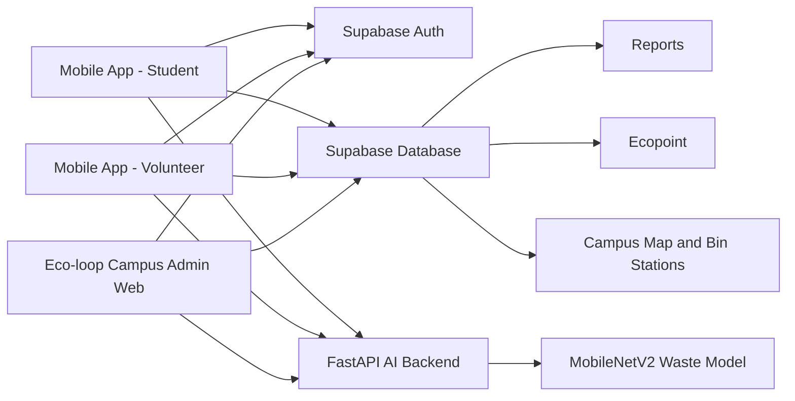

# Eco-loop Campus – Mô hình phân loại và tái chế rác thải trong Trường Đại học Sư phạm Kỹ thuật Hưng Yên theo hướng kinh tế tuần hoàn

Eco-loop Campus là mô hình phân loại, thu gom và tái chế rác thải trong khuôn viên Trường Đại học Sư phạm Kỹ thuật Hưng Yên theo hướng kinh tế tuần hoàn. Repository này chứa web quản trị, backend AI FastAPI, Supabase Auth/Database, bản đồ GIS campus và tài liệu bàn giao để phát triển app mobile.

Dự án dùng AI như một lớp hỗ trợ, không phải toàn bộ nghiệp vụ. Luồng chính là sinh viên gửi rác tái chế, app tạo QR giao dịch, tình nguyện viên xác nhận rác thật tại trạm, hệ thống ghi nhận Ecopoint và admin theo dõi báo cáo.


---

## Table of Contents

- [Problem Statement](#problem-statement)
- [Objectives](#objectives)
- [System Architecture](#system-architecture)
- [Technologies Used](#technologies-used)
- [Features](#features)
- [Deployment and Local URLs](#deployment-and-local-urls)
- [Installation and Setup](#installation-and-setup)
- [Usage](#usage)
- [Project Structure](#project-structure)
- [Mobile App Direction](#mobile-app-direction)
- [Future Scope](#future-scope)
- [Credits and Acknowledgements](#credits-and-acknowledgements)

---

## Problem Statement

Waste management in a university campus is difficult when recyclable waste, organic waste, hazardous waste, and remaining waste are mixed together. This reduces recycling efficiency, makes reporting impossible, and weakens long-term student participation.

Eco-loop Campus solves this problem by combining:

- Classified collection stations and QR-based confirmation.
- Student and volunteer workflows.
- Ecopoint rewards, missions, leaderboard, and reward redemption.
- Admin reporting for scans, bins, feedback, points, and campus operations.
- AI-based waste recognition as a support tool for classification and verification.

The core business problem is not only image classification. The project needs an operating system for a school recycling loop: collect correct data, verify real submissions, reward valid behavior, detect abnormal activity, and export reports for management.

---

## Objectives

1. **Campus Waste Operation Management**
   Manage bins, QR stations, user roles, feedback, Ecopoint rules, and reports for school-scale recycling operations.

2. **Student Recycling Workflow**
   Prepare a mobile-first flow where students find stations, submit recyclable waste, create QR transactions, track status, and receive points after verification.

3. **Volunteer Verification Workflow**
   Support a future volunteer app for scanning QR transactions, checking real waste, capturing proof images, accepting or rejecting submissions, and logging abnormal cases.

4. **AI-Assisted Waste Classification**
   Use MobileNetV2 to classify waste images into 10 AI classes and map them into 4 school bin groups.

5. **Ecopoint and Engagement**
   Record point history, manual adjustments, leaderboard data, reward redemptions, and green participation metrics.

6. **Admin Reporting and Campus Map**
   Provide KPI dashboards, operational reports, CSV export, bin capacity alerts, feedback alerts, and GIS campus visualization.

---

## System Architecture



Current system boundaries:

| Layer | Current responsibility |
|---|---|
| React admin web | Admin dashboard, CRUD screens, reports, map, AI testing |
| FastAPI backend | `/predict` AI inference and `/chat` local chatbot endpoint |
| Supabase Auth | Admin login and future mobile login |
| Supabase Database | Users, bins, predictions, point rules, point history, feedback, rewards, settings |
| localStorage fallback | Demo/offline fallback when Supabase is unavailable |
| Mobile app | Planned next phase based on `MOBILE_APP_HANDOFF.md` |

---

## Technologies Used

| Component | Technology | Purpose |
|---|---|---|
| Backend | Python, FastAPI, Uvicorn | AI API and chatbot endpoint |
| AI/ML | TensorFlow, Keras, MobileNetV2 | Waste classification |
| Frontend | React CRA, JavaScript, React Router | Admin web application |
| UI and charts | Chart.js, react-chartjs-2, Phosphor Icons | Dashboard, KPI, icon system |
| Map | Leaflet, GeoJSON, Proj4 | Campus map and bin station visualization |
| Database/Auth | Supabase Auth, Supabase Database | Admin auth and operational data |
| Fallback storage | localStorage | Demo/offline data fallback |
| Testing | Jest, React Testing Library, Pytest | Frontend and backend verification |
| Training | ImageDataGenerator, transfer learning, fine-tuning | MobileNetV2 training pipeline |

---

## Features

### Admin Authentication

- Supabase email/password login.
- Admin-only access using `users.role = admin` and `users.status = active`.
- Unauthorized users are blocked from the admin shell.

### Dashboard

- KPI cards for scans, pending approvals, open feedback, attention bins, and Ecopoint.
- Charts for scans, points, waste groups, feedback, and full bins.
- Alert links from dashboard to filtered pages.
- GIS campus map with interactive bin/station dots.

### Scans and AI Review

- List AI predictions from upload or camera.
- Show class, confidence, bin group, user, bin, and status.
- Approve or reject AI scan records.
- Write point history when an approved scan matches enabled point rules.

### Users, Classes, and Departments

- Manage students, teachers, volunteers, and admins.
- Search and filter by role, class/department, points, and status.
- Add, edit, and lock users.

### Bins and QR Stations

- Manage bin/station ID, name, bin group, location, building, floor, QR code, status, and capacity.
- Status support: active, full, maintenance.
- Capacity alert when a bin reaches 85% or higher.
- Drag station markers on the map and confirm or cancel location changes.

### Ecopoint

- Configure point rules for waste groups.
- View point history with filters.
- Add manual point adjustments with reasons.
- Show individual and group leaderboards.
- Manage reward redemption requests.

### Feedback

- Create and manage user feedback.
- Filter by status, priority, bin/station, and query.
- Add admin notes and update processing state.
- Surface unresolved feedback in dashboard alerts.

### Reports

- Filter by date range, building, and bin group.
- Summarize scans, points, feedback, and full bins.
- Generate charts and grouped operational tables.
- Export CSV from Supabase/fallback data.

### AI Tester

- Upload image or use camera.
- Call `http://127.0.0.1:8000/predict`.
- Select QR/bin context.
- Save predictions to Supabase or local fallback.

### Model Settings

- Display MobileNetV2 model information.
- Show 10 AI classes.
- Configure confidence warning threshold.

---

## Deployment and Local URLs

The current verified setup is local development. Public deployment URLs are not treated as the source of truth for this project phase.

| Service | URL |
|---|---|
| Frontend admin | `http://127.0.0.1:3000/#/dashboard` |
| Login page | `http://127.0.0.1:3000/#/login` |
| Backend API | `http://127.0.0.1:8000` |
| Backend docs | `http://127.0.0.1:8000/docs` |
| AI predict endpoint | `http://127.0.0.1:8000/predict` |

---

## Installation and Setup

### Prerequisites

- Python 3.10
- Node.js 18 or higher
- npm
- Supabase project with Auth and Database enabled
- Optional: Ollama with `llama3` for local chatbot responses

### Backend Setup

```powershell
cd backend
py -3.10 -m venv .venv
.\.venv\Scripts\activate
pip install -r requirements.txt
uvicorn app:app --reload
```

Backend runs on:

```text
http://127.0.0.1:8000
```

### Frontend Setup

```powershell
cd frontend\waste-frontend
npm install
npm start
```

Frontend runs on:

```text
http://127.0.0.1:3000
```

### Supabase Setup

Run schema file on the real Supabase project:

```text
frontend/waste-frontend/supabase/schema.sql
```

Frontend environment variables:

```env
REACT_APP_SUPABASE_URL=<supabase-project-url>
REACT_APP_SUPABASE_PUBLISHABLE_KEY=<supabase-publishable-key>
REACT_APP_API_URL=http://127.0.0.1:8000
```

Do not commit real `.env` files. Only `.env.example` should be committed.

### Quick Start Scripts

From project root:

```bat
start_backend.bat
start_frontend.bat
```

---

## Usage

1. Start backend and frontend.
2. Open `http://127.0.0.1:3000/#/login`.
3. Sign in with a Supabase Auth account that also exists in `users` with role `admin`.
4. Use Dashboard to monitor KPIs, alerts, reports, and campus map.
5. Use Bins to manage QR stations and bin capacity.
6. Use AI Tester to upload/capture a waste image and call `/predict`.
7. Use Scans to approve/reject AI records.
8. Use Ecopoint to manage rules, point history, leaderboard, manual adjustments, and rewards.
9. Use Feedback and Reports to handle operations and export CSV.

---

## Project Structure

```text
Smart-Waste-Detection-and-Segregation-Platform-main/
  backend/
    app.py
    model/
      mobilenetv2_model.h5
      mobilenetv3_model.keras
    requirements.txt
    test_app_endpoints.py
    test_app_startup.py
  frontend/
    waste-frontend/
      public/assets/geojson/
      src/admin/
        AdminApp.js
        admin.css
        components/
        data/
        pages/
        services/
      src/supabaseClient.js
      supabase/schema.sql
      package.json
  model_training/
    dataset/
    train_mobilenetv2.py
    train_mobilenetv3.py
  FUNCTION_TEST_ROADMAP.md
  MOBILE_APP_HANDOFF.md
  start_backend.bat
  start_frontend.bat
  README.md
```

---

## AI Model and Waste Mapping

Model file:

```text
backend/model/mobilenetv2_model.h5
```

Training script:

```text
model_training/train_mobilenetv2.py
```

Model facts:

- Architecture: MobileNetV2 transfer learning.
- Input size: `224x224` RGB image.
- Output: 10-class softmax.
- Dataset layout: folder-per-class under `model_training/dataset`.
- Training: `ImageDataGenerator`, augmentation, validation split, frozen base training, then fine-tuning.

AI classes:

```text
battery, biological, cardboard, clothes, glass, metal, paper, plastic, shoes, trash
```

Mapping to school bin groups:

| AI class | Bin group |
|---|---|
| `biological` | Hữu cơ |
| `paper`, `cardboard`, `plastic`, `glass`, `metal` | Tái chế |
| `battery` | Pin / nguy hại |
| `clothes`, `shoes`, `trash` | Còn lại |

Important rule: AI does not directly award points. Ecopoint should be awarded after volunteer or admin verification.

---

## Supabase Data Model

Current tables:

| Table | Purpose |
|---|---|
| `users` | User profile, role, group/class, points, status |
| `bins` | Bin/station data, QR code, location, capacity, map coordinates |
| `predictions` | AI scan records and AI proof data |
| `point_rules` | Ecopoint rules by waste class and bin group |
| `point_history` | Point transaction history |
| `feedback` | Feedback and admin handling notes |
| `reward_redemptions` | Reward redemption requests |
| `settings` | Model threshold and AI metadata |

Target mobile tables to add later:

| Table | Purpose |
|---|---|
| `waste_types` | Recycling categories, units, point rules |
| `recycling_submissions` | Student waste submission transactions and QR state |
| `qr_scan_logs` | Every QR scan result, including invalid cases |
| `proof_images` | Volunteer proof photos and hashes |
| `missions` | Green weekly/monthly missions |
| `user_missions` | User mission progress |
| `rewards` | Reward catalog |
| `recycling_partners` | Recycling partners |
| `recycling_batches` | Waste transfer batches |
| `sponsors` | Sponsors and voucher partners |

---

## Mobile App Direction

The mobile app should follow the Eco-loop Campus operation-first model.

### Student App

- Login and load profile from Supabase.
- View Ecopoint wallet, missions, nearby stations, and main CTA `Gửi rác tái chế`.
- Search waste sorting guide.
- Find stations by building, floor, room, or map.
- Create recycling submission with waste type, station, quantity, and unit.
- Generate one-time QR transaction.
- Track submission status, point history, leaderboard, rewards, and feedback.

### Volunteer App

- Login with volunteer/admin role.
- Select assigned station.
- Scan student QR transaction.
- Verify token, station, role, expiry, and status.
- Check real waste, adjust quantity, capture proof image.
- Accept/reject submission and write abnormal notes.
- Monitor station capacity and unresolved feedback.

### QR Anti-Fraud Rules

- QR token must be one-time and time-limited.
- QR token must not contain editable point/user data.
- Every scan must create a log: `SUCCESS`, `EXPIRED`, `ALREADY_USED`, `INVALID_TOKEN`, `WRONG_STATION`, `INVALID_ROLE`, or `SUSPECTED_FRAUD`.
- Point updates should use RPC, Edge Function, or backend API for atomic writes.
- Mobile clients should not update `users.points` directly.

---

## Future Scope

- Add `recycling_submissions`, `waste_types`, `qr_scan_logs`, and `proof_images` for true mobile operations.
- Build Flutter student app for QR submissions and Ecopoint wallet.
- Build volunteer scanner flow for QR verification and proof image capture.
- Add Supabase Storage for proof images.
- Add RPC/Edge Functions for secure QR generation, verification, and point awarding.
- Add indoor maps by building, floor, room, and station position.
- Add missions, reward catalog, sponsor integration, and recycling partner batches.
- Add Eco Community for green posts, likes, comments, saved posts, and moderation.
- Convert model to TensorFlow Lite if mobile on-device inference becomes required.

---

## Testing

Frontend:

```powershell
cd frontend\waste-frontend
npm test -- --watchAll=false --runInBand --silent
npm run build
```

Backend:

```powershell
backend\.venv\Scripts\python.exe -m pytest -q
```

Diff check:

```powershell
git diff --check
```

Detailed function test plan:

```text
FUNCTION_TEST_ROADMAP.md
```

---

## Credits and Acknowledgements

- **Dataset:** Garbage Dataset
- **Supervisor:** Nguyễn Thị Tươi, Ngô Quang Hiệp

### Team Members

- Phạm Thanh Hương (11425064)
- Nguyễn Phương Thảo (11425159)
- Đào Minh Quang (10123264)
- Phan Văn Khánh (12523037)