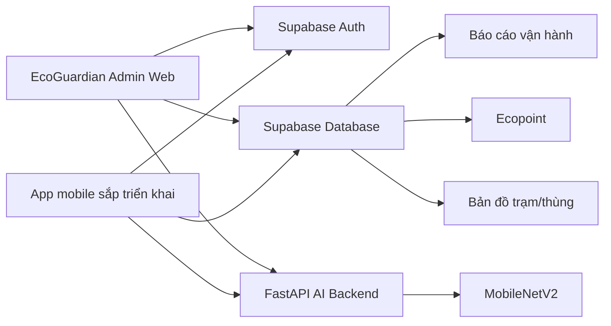

# Eco-loop Campus / EcoGuardian

Eco-loop Campus là mô hình phân loại, thu gom và tái chế rác thải trong phạm vi trường học theo hướng kinh tế tuần hoàn. Repository này là nền kỹ thuật hiện tại của dự án: web admin EcoGuardian, backend AI nhận diện rác bằng MobileNetV2, cấu hình Supabase Auth/Database, dữ liệu mẫu và tài liệu bàn giao để phát triển app mobile.

Trọng tâm sản phẩm không còn là một web demo chỉ chụp ảnh AI. Hệ thống được định hướng theo quy trình vận hành thật trong trường học:

```text
Sinh viên phân loại rác
-> Mang rác đến trạm Eco-loop
-> Tạo giao dịch/QR trên app
-> Tình nguyện viên kiểm tra và xác nhận
-> Hệ thống ghi nhận Ecopoint
-> Admin theo dõi, báo cáo, xử lý bất thường
-> Rác được tập kết và chuyển cho đơn vị tái chế
```

## Thông tin dự án

| Nội dung | Thông tin |
|---|---|
| Tên nghiệp vụ | Eco-loop Campus |
| Nền quản trị | EcoGuardian Admin Web |
| Phạm vi mẫu | Trường Đại học Sư phạm Kỹ thuật Hưng Yên |
| Định hướng | Môi trường, công nghệ số, kinh tế tuần hoàn, trường học xanh |
| Dataset | Garbage Dataset |
| AI model | MobileNetV2, 10 lớp rác, input ảnh 224x224 |
| Database/Auth | Supabase Auth + Supabase Database |
| Backend AI | FastAPI |
| Frontend admin | React CRA, React Router, Chart.js, Leaflet, Phosphor Icons |

## Người hướng dẫn và thành viên

**Supervisor:** Nguyễn Thị Tươi, Ngô Quang Hiệp

**Team Members**

- Phạm Thanh Hương (11425064)
- Nguyễn Phương Thảo (11425159)
- Đào Minh Quang (10123264)
- Phan Văn Khánh (12523037)

## Kiến trúc hiện tại



Các thành phần chính:

- **Web admin EcoGuardian:** quản trị người dùng, thùng/trạm, lượt quét AI, điểm thưởng, phản hồi, báo cáo, bản đồ campus và cài đặt model.
- **FastAPI backend:** cung cấp API nhận diện ảnh `/predict` và chatbot `/chat`.
- **Supabase:** xác thực admin, lưu dữ liệu quản trị, bật RLS qua file schema.
- **localStorage fallback:** web admin vẫn có lớp dự phòng khi Supabase lỗi hoặc chưa cấp quyền.
- **Mobile handoff:** file `MOBILE_APP_HANDOFF.md` mô tả hướng triển khai app sinh viên và app tình nguyện viên.

## Chức năng admin hiện có

### Đăng nhập và phân quyền

- Đăng nhập bằng Supabase Auth email/password.
- Chỉ tài khoản có `role = admin` và `status = active` trong bảng `users` được vào admin shell.
- Tài khoản không có quyền sẽ thấy màn hình chặn truy cập.

### Dashboard tổng quan

- KPI lượt quét, lượt chờ duyệt, phản hồi mở, thùng cần chú ý và Ecopoint.
- Biểu đồ lượt quét, điểm, nhóm rác.
- Cảnh báo thùng đầy, phản hồi chưa xử lý, confidence thấp.
- Bản đồ GIS campus dùng GeoJSON/Leaflet, hiển thị vị trí thùng bằng chấm, hover/click xem chi tiết.

### Lượt quét / Duyệt AI

- Danh sách kết quả AI từ upload/camera.
- Hiển thị class, confidence, nhóm thùng, trạng thái, user, bin.
- Duyệt/từ chối lượt quét.
- Khi duyệt hợp lệ, hệ thống ghi `point_history` theo rule điểm.

### Người dùng / lớp / khoa

- Quản lý sinh viên, giáo viên, tình nguyện viên, admin.
- Tìm kiếm, lọc vai trò, lọc lớp/khoa, trạng thái.
- Thêm/sửa/khóa người dùng.
- Theo dõi tổng điểm từng người dùng.

### Thùng rác / trạm QR

- Quản lý thùng hoặc trạm theo tòa nhà, tầng, vị trí, mã QR.
- Nhóm rác: Hữu cơ, Tái chế, Pin / nguy hại, Còn lại.
- Trạng thái: hoạt động, đầy, bảo trì.
- Sức chứa mô phỏng, cảnh báo khi vượt ngưỡng 85%.
- Kéo thả chấm trên map để chỉnh vị trí, có xác nhận hoặc hủy.

### Ecopoint

- Cấu hình rule điểm theo nhóm rác.
- Lịch sử điểm chi tiết.
- Cộng/trừ điểm thủ công có lý do.
- Bảng xếp hạng cá nhân, lớp/khoa.
- Yêu cầu đổi thưởng và trạng thái xử lý.

### Phản hồi

- Tạo, xem, lọc phản hồi theo trạng thái, ưu tiên, thùng/trạm.
- Xử lý phản hồi, cập nhật ghi chú admin.
- Liên kết cảnh báo phản hồi với Dashboard.

### Báo cáo vận hành

- Lọc theo ngày, tòa nhà, nhóm rác.
- Tổng hợp lượt quét, Ecopoint, phản hồi, thùng đầy.
- Bảng nhóm rác và CSV export dùng dữ liệu thật từ Supabase/fallback.

### Kiểm thử AI

- Upload ảnh hoặc dùng camera.
- Gọi backend `http://127.0.0.1:8000/predict`.
- Gắn kết quả với trạm/thùng QR nếu có.
- Lưu prediction vào Supabase hoặc localStorage fallback.

### Cài đặt model

- Hiển thị model MobileNetV2.
- Hiển thị 10 lớp AI.
- Cấu hình ngưỡng confidence cảnh báo.

## AI model

Backend hiện dùng model tại:

```text
backend/model/mobilenetv2_model.h5
```

Thông tin chính:

- Kiến trúc: MobileNetV2 transfer learning.
- Input: ảnh RGB resize về `224x224`.
- Output: softmax 10 lớp.
- Training script: `model_training/train_mobilenetv2.py`.
- Dataset theo thư mục class trong `model_training/dataset`.
- Train bằng `ImageDataGenerator`, validation split 10%, augmentation cơ bản.
- Fine-tuning sau giai đoạn frozen base model.

10 lớp AI:

```text
battery, biological, cardboard, clothes, glass, metal, paper, plastic, shoes, trash
```

Mapping sang 4 nhóm thùng:

| AI class | Nhóm thùng |
|---|---|
| biological | Hữu cơ |
| paper, cardboard, plastic, glass, metal | Tái chế |
| battery | Pin / nguy hại |
| clothes, shoes, trash | Còn lại |

Trong luồng Eco-loop Campus, AI chỉ đóng vai trò gợi ý/kiểm chứng. AI không tự cộng điểm trực tiếp. Điểm chỉ được ghi sau khi tình nguyện viên hoặc admin xác nhận.

## Backend API hiện có

Backend chạy bằng FastAPI trong `backend/app.py`.

| Method | Endpoint | Mô tả |
|---|---|---|
| GET | `/` | Kiểm tra backend đang chạy |
| POST | `/predict` | Nhận ảnh `multipart/form-data file`, trả `{ class, confidence }` |
| POST | `/chat` | Nhận `{ message }`, trả `{ reply }` từ chatbot local nếu khả dụng |

Ví dụ gọi `/predict`:

```http
POST /predict
Content-Type: multipart/form-data

file=<image.jpg>
```

Response mẫu:

```json
{
  "class": "plastic",
  "confidence": 0.9231
}
```

## Supabase schema hiện có

Schema chính nằm tại:

```text
frontend/waste-frontend/supabase/schema.sql
```

Bảng đang có:

| Bảng | Vai trò |
|---|---|
| `users` | Hồ sơ user, role, lớp/khoa, điểm, trạng thái |
| `bins` | Thùng/trạm, nhóm rác, QR, vị trí, sức chứa, trạng thái |
| `predictions` | Lượt AI scan hoặc proof nhận diện |
| `point_rules` | Rule tính điểm theo class/nhóm rác |
| `point_history` | Lịch sử cộng/trừ Ecopoint |
| `feedback` | Phản hồi người dùng và ghi chú xử lý |
| `reward_redemptions` | Yêu cầu đổi thưởng |
| `settings` | Cài đặt model, threshold, số lớp |

RLS hiện tại:

- Người dùng authenticated được đọc dữ liệu cần thiết.
- Quyền ghi các bảng quản trị giới hạn cho admin qua function `public.is_admin()`.
- Mobile thật cần bổ sung policy riêng cho `student` và `volunteer` trước khi triển khai production.

## Database mục tiêu cho mobile Eco-loop

Các bảng hiện có đủ cho admin demo, nhưng app mobile vận hành đúng nghiệp vụ cần thêm bảng trung tâm cho giao dịch gửi rác:

| Bảng cần thêm | Mục đích |
|---|---|
| `waste_types` | Danh mục loại rác tái chế, đơn vị tính, điểm/unit |
| `recycling_submissions` | Giao dịch sinh viên gửi rác, QR token, trạng thái xác nhận |
| `qr_scan_logs` | Log mọi lần quét QR, kể cả thất bại |
| `proof_images` | Ảnh chứng minh khi volunteer xác nhận |
| `missions` | Nhiệm vụ xanh theo tuần/tháng |
| `user_missions` | Tiến độ nhiệm vụ của từng user |
| `rewards` | Catalog phần thưởng |
| `recycling_partners` | Đơn vị thu gom/tái chế |
| `recycling_batches` | Đợt chuyển giao rác cho đối tác |
| `sponsors` | Doanh nghiệp tài trợ, voucher, quà |

Trạng thái QR/giao dịch đề xuất:

```text
CREATED -> VERIFIED -> ACCEPTED -> COMPLETED -> LOCKED
```

Nhánh phụ:

```text
EXPIRED, REJECTED, PENDING_REVIEW, CANCELLED
```

Kết quả log quét QR cần hỗ trợ:

```text
SUCCESS, EXPIRED, ALREADY_USED, INVALID_TOKEN, WRONG_STATION, INVALID_ROLE, SUSPECTED_FRAUD
```

## Luồng mobile đề xuất

### App sinh viên

- Đăng nhập bằng Supabase Auth.
- Xem điểm, nhiệm vụ xanh, trạm gần nhất.
- Xem hướng dẫn phân loại rác.
- Tìm trạm/thùng theo tòa nhà, tầng, vị trí.
- Tạo giao dịch gửi rác: chọn trạm, loại rác, số lượng/khối lượng.
- Sinh QR giao dịch một lần, có hạn.
- Theo dõi trạng thái giao dịch.
- Xem ví Ecopoint, lịch sử điểm, bảng xếp hạng.
- Đổi thưởng.
- Gửi phản hồi về thùng đầy, QR lỗi, sai vị trí, vấn đề khác.

### App tình nguyện viên

- Đăng nhập bằng role `volunteer` hoặc `admin`.
- Chọn trạm đang trực.
- Quét QR giao dịch của sinh viên.
- Kiểm tra token, hạn, trạng thái, đúng trạm.
- Xác nhận loại rác thật, chỉnh số lượng/khối lượng nếu cần.
- Chụp ảnh proof.
- Chấp nhận hoặc từ chối giao dịch, ghi chú bất thường.
- Theo dõi trạng thái trạm, sức chứa, phản hồi mở.

### Nguyên tắc chống gian lận

- QR token không chứa điểm, email, role hoặc dữ liệu có thể tự sửa.
- QR chỉ dùng một lần và có thời hạn.
- Mỗi lần quét QR đều ghi `qr_scan_logs`.
- Ảnh proof ưu tiên chụp trực tiếp bằng camera.
- Cộng điểm nên qua RPC/Edge Function/backend để ghi transaction và cập nhật điểm theo thao tác atomic.
- Mobile không nên tự update trực tiếp `users.points`.

## Bản đồ campus và thùng rác

Admin web hiện có bản đồ campus mô phỏng bằng Leaflet/GeoJSON. Dữ liệu GeoJSON nằm trong:

```text
frontend/waste-frontend/public/assets/geojson
```

MVP hiện lưu vị trí thùng bằng `bins.map_x` và `bins.map_y` theo phần trăm trên bản đồ. Về sau, khi có sơ đồ phòng/tầng trong trường, nên mở rộng:

```text
buildings -> floors -> rooms -> bins
```

Trường dữ liệu nên bổ sung:

- `building_id`
- `floor_id`
- `near_room_id`
- `position_x`
- `position_y`
- `map_image_url`

Với app mobile, không nên phụ thuộc GPS để định vị thùng trong nhà. Nên dùng bản đồ nội bộ theo tòa/tầng/phòng + QR định danh từng thùng/trạm.

## Cách chạy local

Từ root project:

```bat
start_backend.bat
start_frontend.bat
```

Hoặc chạy thủ công.

Backend:

```powershell
cd backend
py -3.10 -m venv .venv
.\.venv\Scripts\activate
pip install -r requirements.txt
uvicorn app:app --reload
```

Frontend:

```powershell
cd frontend\waste-frontend
npm install
npm start
```

URL local:

```text
Frontend admin: http://127.0.0.1:3000/#/dashboard
Login admin:    http://127.0.0.1:3000/#/login
Backend API:    http://127.0.0.1:8000
Backend docs:   http://127.0.0.1:8000/docs
```

Env frontend dùng dạng:

```env
REACT_APP_SUPABASE_URL=<supabase-project-url>
REACT_APP_SUPABASE_PUBLISHABLE_KEY=<supabase-publishable-key>
REACT_APP_API_URL=http://127.0.0.1:8000
```

Không commit file `.env` thật. Repo chỉ nên commit `.env.example`.

## Cấu trúc thư mục chính

```text
Smart-Waste-Detection-and-Segregation-Platform-main/
  backend/
    app.py
    model/
      mobilenetv2_model.h5
      mobilenetv3_model.keras
    requirements.txt
    test_app_endpoints.py
    test_app_startup.py
  frontend/
    waste-frontend/
      public/assets/geojson/
      src/admin/
        AdminApp.js
        admin.css
        components/
        data/
        pages/
        services/
      src/supabaseClient.js
      supabase/schema.sql
      package.json
  model_training/
    dataset/
    train_mobilenetv2.py
    train_mobilenetv3.py
  MOBILE_APP_HANDOFF.md
  FUNCTION_TEST_ROADMAP.md
  start_backend.bat
  start_frontend.bat
  README.md
```

## Test và kiểm chứng

Frontend:

```powershell
cd frontend\waste-frontend
npm test -- --watchAll=false --runInBand --silent
npm run build
```

Backend:

```powershell
backend\.venv\Scripts\python.exe -m pytest -q
```

Kiểm tra Git diff:

```powershell
git diff --check
```

Roadmap test chi tiết nằm tại `FUNCTION_TEST_ROADMAP.md`. Tài liệu này chia các chức năng thành nhóm nhỏ, ghi baseline test, case đã cover và những guard đã sửa.

## Roadmap triển khai tiếp

1. Hoàn thiện schema mobile: `waste_types`, `recycling_submissions`, `qr_scan_logs`, `proof_images`.
2. Viết RPC/Edge Function/backend cho tạo QR, xác nhận QR và cộng điểm atomic.
3. Viết RLS riêng cho student/volunteer/admin.
4. Dựng app mobile Flutter cho sinh viên: login, home, trạm, tạo giao dịch, QR, lịch sử.
5. Dựng app/role tình nguyện viên: scan QR, xác nhận rác, proof image, reject/accept.
6. Kết nối Ecopoint, leaderboard, nhiệm vụ xanh, rewards.
7. Mở rộng bản đồ nội bộ theo tòa nhà, tầng, phòng.
8. Bổ sung chống gian lận nâng cao, Eco Community, đối tác tái chế và tài trợ.

## Tài liệu liên quan

- `MOBILE_APP_HANDOFF.md`: tài liệu bàn giao chi tiết để bắt đầu làm app mobile theo hướng Eco-loop Campus.
- `FUNCTION_TEST_ROADMAP.md`: kế hoạch kiểm thử từng module hiện có.
- `frontend/waste-frontend/supabase/schema.sql`: schema Supabase hiện tại.
- `model_training/train_mobilenetv2.py`: script train MobileNetV2.
- `backend/app.py`: API FastAPI hiện tại.

## Ghi chú triển khai mobile

Khuyến nghị mặc định là Flutter vì phù hợp demo Android/iOS, camera, QR, map và Supabase SDK. React Native vẫn dùng được nếu đội muốn giữ tư duy React từ web admin.

Thứ tự đúng cho mobile: giao dịch gửi rác và QR trước, volunteer xác nhận sau, rồi Ecopoint/leaderboard/reward, tiếp theo là map nội bộ, chống gian lận nâng cao, đối tác tái chế và Eco Community.

## Credits

- **Dataset:** Garbage Dataset
- **Supervisor:** Nguyễn Thị Tươi, Ngô Quang Hiệp
- **Team Members:** Phạm Thanh Hương (11425064), Nguyễn Phương Thảo (11425159), Đào Minh Quang (10123264), Phan Văn Khánh (12523037)
