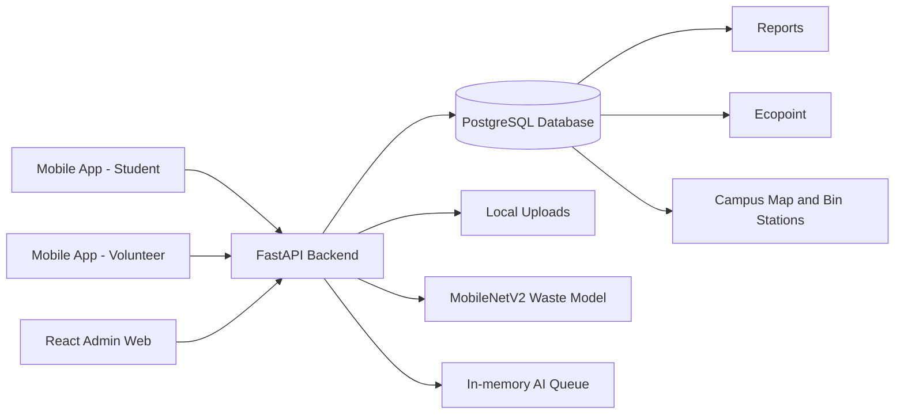

# Eco-loop Campus - Mô hình phân loại và tái chế rác thải trong trường học theo hướng kinh tế tuần hoàn

Eco-loop Campus là hệ thống quản lý phân loại, thu gom và tái chế rác thải trong khuôn viên trường. Repository này chứa web quản trị, backend FastAPI, PostgreSQL native, AI phân loại rác và app mobile Android cho sinh viên/tình nguyện viên.

Dự án dùng AI như một lớp hỗ trợ, không thay thế quy trình xác nhận thật. Luồng chính là sinh viên gửi rác tái chế, app tạo QR giao dịch, tình nguyện viên quét QR và gửi ảnh minh chứng, hệ thống ghi nhận Ecopoint sau khi xác nhận.


---

## Table of Contents

- [Problem Statement](#problem-statement)
- [Objectives](#objectives)
- [System Architecture](#system-architecture)
- [Technologies Used](#technologies-used)
- [Features](#features)
- [Deployment and Local URLs](#deployment-and-local-urls)
- [Installation and Setup](#installation-and-setup)
- [Public Setup with Cloudflare Tunnel](#public-setup-with-cloudflare-tunnel)
- [Usage](#usage)
- [Project Structure](#project-structure)
- [AI Model and Waste Mapping](#ai-model-and-waste-mapping)
- [PostgreSQL Data Model](#postgresql-data-model)
- [Mobile App Direction](#mobile-app-direction)
- [Future Scope](#future-scope)
- [Testing](#testing)
- [Credits and Acknowledgements](#credits-and-acknowledgements)

---

## Problem Statement

Việc phân loại rác trong môi trường trường học dễ bị thiếu dữ liệu, thiếu xác nhận thật và khó tạo động lực lâu dài cho sinh viên. Nếu rác tái chế, rác hữu cơ, pin/nguy hại và rác còn lại bị trộn lẫn, nhà trường khó theo dõi hiệu quả thu gom, khó thống kê báo cáo và khó khuyến khích hành vi xanh.

Eco-loop Campus giải quyết vấn đề bằng cách kết hợp:

- Trạm/thùng rác có QR định danh rõ ràng.
- App student để gửi rác, tạo QR giao dịch và theo dõi điểm.
- App volunteer để quét QR, chụp ảnh minh chứng và xác nhận.
- Web admin để quản lý người dùng, trạm, avatar, phần thưởng, nhiệm vụ, feedback và báo cáo.
- PostgreSQL làm nguồn dữ liệu gốc.
- FastAPI làm backend Auth/API/AI.
- AI MobileNetV2 hỗ trợ gợi ý phân loại rác.

Trọng tâm dự án không chỉ là nhận diện ảnh. Hệ thống cần vận hành được một vòng tuần hoàn trong trường: tạo dữ liệu đúng, xác nhận giao dịch thật, cộng điểm minh bạch, chặn gian lận QR và xuất báo cáo cho quản lý.

---

## Objectives

1. **Campus Waste Operation Management**
   Quản lý trạm/thùng rác, QR, người dùng, avatar, phản hồi, Ecopoint, phần thưởng, nhiệm vụ và báo cáo vận hành.

2. **Student Recycling Workflow**
   Cho phép sinh viên đăng ký/đăng nhập, tìm trạm, quét QR trạm, gửi rác, tạo QR giao dịch, nhận điểm sau khi được xác nhận và đổi thưởng.

3. **Volunteer Verification Workflow**
   Cho phép tình nguyện viên đăng ký ở trạng thái chờ duyệt, được admin duyệt, chọn trạm trực, quét QR giao dịch, gửi proof và xác nhận/từ chối/yêu cầu xem xét.

4. **AI-Assisted Waste Classification**
   Dùng MobileNetV2 phân loại 10 lớp rác và ánh xạ sang nhóm thùng phù hợp bằng tiếng Việt.

5. **Ecopoint and Engagement**
   Ghi nhận điểm, lịch sử điểm, bảng xếp hạng, nhiệm vụ xanh, yêu cầu đổi thưởng và trạng thái phần thưởng.

6. **Portable Server Deployment**
   Cho phép chuyển dự án sang laptop server Windows bằng PostgreSQL native + backend + web ổn định trong LAN, không cần Docker/WSL2.

---

## System Architecture



Current system boundaries:

| Layer | Current responsibility |
|---|---|
| React admin web | Admin dashboard, CRUD screens, reports, map, avatar, AI testing |
| FastAPI backend | Auth, admin API, mobile API, upload files, QR/Ecopoint transaction, AI queue |
| PostgreSQL | Source of truth for users, bins, QR, submissions, points, rewards, missions, feedback |
| Local uploads | Avatar presets, proof images, AI prediction images served through `/uploads/...` |
| Mobile app | Student and volunteer workflows, backend polling, QR, map, AI suggestion |
| Native Windows server | Runs PostgreSQL, FastAPI backend and web admin on a laptop server |

Supabase is no longer the runtime database/auth provider. Some Supabase SQL files remain only as legacy/demo/migration references.

---

## Technologies Used

| Component | Technology | Purpose |
|---|---|---|
| Backend | Python 3.10, FastAPI, Uvicorn | Auth, API, AI queue, uploads, QR/Ecopoint |
| Database | PostgreSQL 15+, psycopg | Operational data source of truth |
| AI/ML | TensorFlow 2.13, Keras, MobileNetV2 | Waste classification |
| Frontend | React CRA, JavaScript, React Router | Admin web application |
| UI and charts | Chart.js, react-chartjs-2, Phosphor Icons | Dashboard, KPI, chart and icon system |
| Map | Leaflet on web, WebView/SVG map support on mobile | Campus bin station map |
| Mobile | Expo, React Native, Android APK | Student and volunteer app |
| QR | JSON QR payload v1, react-native-qrcode-svg, qrcode.react | Station QR and submission QR |
| Uploads | FastAPI multipart + local static files | Avatar, proof and prediction images |
| Deployment | Native Windows batch scripts | Laptop server setup without Docker/WSL2 |
| Testing | Pytest, Jest, React Testing Library, node:test, TypeScript | Backend, web and mobile verification |

---

## Features

### Admin Authentication

- Backend email/password login.
- JWT bearer token stored by web/mobile clients.
- Admin-only access using `users.role = admin` and `users.status = active`.
- Student accounts register as active.
- Volunteer accounts register as pending and require admin approval.
- Password change requires the current password.

### Dashboard

- KPI cards for scans, pending approvals, feedback, bin attention and Ecopoint.
- Charts for scans, points, waste groups, feedback and bin status.
- Dashboard data loads from PostgreSQL through FastAPI.
- Polling keeps important pages refreshed without Supabase realtime.

### Scans and AI Review

- List AI predictions from upload, camera or mobile.
- Show class, confidence, bin group, user, bin and status.
- Approve or reject scan records.
- AI tester uses queue first: `POST /predict/jobs`, then polls `GET /predict/jobs/{job_id}`.
- Fallback direct endpoint `POST /predict` remains available.

### Users, Classes, and Departments

- Manage students, volunteers, teachers and admins from PostgreSQL profiles.
- Search and filter by role, class/group, points and status.
- Lock/unlock users.
- Approve pending volunteers.
- Manual "add user" UI is intentionally removed; users register from app or are imported/bootstraped through backend scripts.

### Bins and QR Stations

- Manage station ID, name, bin group, location, building, floor, QR code, status and capacity.
- Station QR uses Eco-loop JSON payload v1.
- Admin map supports marker location editing.
- Mobile map reads the same backend coordinates.
- Stations missing `map_x/map_y` remain in lists but are not drawn as map markers.

### Ecopoint

- Configure point rules for waste groups.
- View point history and user leaderboard.
- Reward redemptions are stored in PostgreSQL.
- Points are awarded through backend transaction/RPC-style logic, not directly by the client.
- QR flow blocks expired, reused, wrong-station and invalid tokens.

### Feedback

- Students can submit feedback from the mobile app.
- Admin can filter feedback by status, priority, station and query.
- Admin can update status and notes.
- Unresolved feedback appears in operational views.

### Reports

- Filter by date range, building and bin group.
- Summarize scans, points, feedback and bin status.
- Export report data from PostgreSQL-backed admin data.

### AI Tester

- Upload image or use camera in web admin.
- Health-check backend before sending image.
- Queue endpoint avoids timeout when many devices submit images.
- Successful AI result can be saved as a `predictions` row.

### Model Settings

- Display MobileNetV2 model information.
- Show 10 AI classes.
- Configure confidence warning threshold.
- AI class labels are shown in Vietnamese for users.

### Avatar Presets

- Admin manages avatar presets with only three fields: avatar code, avatar name and uploaded image.
- Uploaded images are served from backend local uploads.
- Mobile profile receives avatar presets from backend and lets students choose from admin-provided options.

---

## Deployment and Local URLs

The project can run in three modes:

- **Native server mode** for a laptop that runs PostgreSQL + backend + web without Docker.
- **Local developer mode** for separate backend/frontend commands.
- **Public demo mode** through temporary Cloudflare quick tunnels.

| Service | Local URL |
|---|---|
| Frontend admin | `http://127.0.0.1:3002/#/dashboard` |
| Login page | `http://127.0.0.1:3002/#/login` |
| Backend API | `http://127.0.0.1:8000` |
| Backend docs | `http://127.0.0.1:8000/docs` |
| DB health | `http://127.0.0.1:8000/api/health/db` |
| AI predict endpoint | `http://127.0.0.1:8000/predict` |
| AI queue endpoint | `http://127.0.0.1:8000/predict/jobs` |
| AI queue health | `http://127.0.0.1:8000/predict/queue` |

For Android Studio Emulator on the same laptop:

```text
http://10.0.2.2:8000
```

For real Android devices in the same Wi-Fi:

```text
http://<LAPTOP_SERVER_LAN_IP>:8000
```

---

## Installation and Setup

### Prerequisites

- Git
- Python 3.10 for backend runtime. `setup_server_full.bat` installs it through `winget` or downloads the official Python 3.10.11 installer.
- Node.js 18+ and npm for web runtime
- PostgreSQL native for the database. `setup_server_full.bat` installs PostgreSQL 15 on older Windows when needed.
- Android Studio for emulator/APK testing, or Android command-line SDK installed by `setup_public_release.bat` when APK build is enabled.
- Optional: Ollama with `llama3` for local chatbot responses

### Native Windows Server Setup

From the project root:

```bat
setup_server_full.bat
```

Run it as Administrator on the laptop server. It checks and installs Python, Node.js, PostgreSQL native and cloudflared, initializes `.runtime\DATABASE_URL.txt`, opens firewall ports `3002` and `8000`, starts backend/web in separate windows and bootstraps the admin account. It does not require Docker, WSL2 or Android Studio.

Default admin:

```text
admin@school.edu.vn / 123456
```

Override admin before setup:

```bat
set ADMIN_EMAIL=admin@example.com
set ADMIN_NAME=Eco-loop Admin
set ADMIN_PASSWORD=your-password
setup_server_full.bat
```

### Docker Compose Setup

```bat
start_docker.bat
```

This is optional legacy/dev convenience for machines that support Docker. The main laptop-server path is native `setup_server_full.bat`.

This uses:

```powershell
docker compose --env-file .env.docker up --build
```

The Docker stack includes:

- `postgres`: PostgreSQL 17 with persistent volume `ecoloop_postgres_data`.
- `backend`: FastAPI + TensorFlow + upload volume.
- `web`: React build served by Nginx on port `3002`.

### Backend Setup

```powershell
cd backend
py -3.10 -m venv .venv
.\.venv\Scripts\activate
pip install -r requirements.txt
python -m uvicorn app:app --host 127.0.0.1 --port 8000 --workers 1
```

Backend requires `DATABASE_URL` to point to PostgreSQL. The Windows launcher can prepare/check the local backend runtime:

```bat
start_backend.bat
```

### Frontend Setup

```powershell
cd frontend\eco-loop-campus-admin
npm install
npm start
```

Frontend environment:

```env
REACT_APP_API_URL=http://127.0.0.1:8000
```

### PostgreSQL Setup

Main schema:

```text
backend/local_db/schema.sql
```

Bootstrap admin:

```text
backend/local_db/bootstrap_admin.sql
scripts/bootstrap_local_admin.ps1
scripts/docker_bootstrap_admin.ps1
```

The database starts blank after schema setup. Demo data is separated and is not loaded by native server setup.

### Quick Start Scripts

From project root:

```bat
setup_server_full.bat
start_docker.bat
start_backend.bat
start_frontend.bat
```

---

## Public Setup with Cloudflare Tunnel

This setup is intended for short demos from another device or network. It exposes:

- FastAPI backend through a public `https://*.trycloudflare.com` URL.
- React admin web through another public `https://*.trycloudflare.com` URL.
- Web build configured to call the public backend URL.

Quick tunnel URLs are temporary. When a tunnel window is closed or restarted, the URL changes. APKs built with the old URL will not call the new backend.

### What the scripts do automatically

- Check and install common Windows runtime dependencies when possible.
- Start FastAPI backend.
- Start Cloudflare tunnel for backend.
- Write `.runtime/api_public_url.txt`.
- Build React admin web with the API public URL.
- Start Cloudflare tunnel for web.
- Write `.runtime/web_public_url.txt`.

### One-command public startup

```bat
scripts\start_laptop_server.bat
```

### Manual public startup

```bat
start_backend.bat
start_frontend.bat
```

### Public API checks

```powershell
Invoke-WebRequest -UseBasicParsing http://127.0.0.1:8000/
Invoke-WebRequest -UseBasicParsing http://127.0.0.1:8000/api/health/db
Invoke-WebRequest -UseBasicParsing http://127.0.0.1:8000/predict/queue
```

Then test the public URL:

```powershell
$api = Get-Content .runtime\api_public_url.txt
Invoke-WebRequest -UseBasicParsing "$api/"
Invoke-WebRequest -UseBasicParsing "$api/api/health/db"
Invoke-WebRequest -UseBasicParsing "$api/predict/queue"
```

Expected backend root response:

```json
{"message":"Eco-loop Campus Backend Running"}
```

### Public web checks

```powershell
$web = Get-Content .runtime\web_public_url.txt
Start-Process "$web/#/login"
```

Test these pages:

- `#/dashboard`
- `#/users`
- `#/avatars`
- `#/bins`
- `#/scans`
- `#/ai-test`
- `#/ecopoints`
- `#/feedback`
- `#/reports`

### Mobile APK and emulator setup for public API

APK release path:

```text
dist/ecoloop-campus-mobile-release.apk
```

For Android Studio Emulator local backend:

```env
EXPO_PUBLIC_API_URL=http://10.0.2.2:8000
```

For real Android device in the same Wi-Fi:

```env
EXPO_PUBLIC_API_URL=http://<LAPTOP_SERVER_LAN_IP>:8000
```

For public tunnel:

```env
EXPO_PUBLIC_API_URL=<api-public-url>
```

Rebuild APK whenever `EXPO_PUBLIC_API_URL` changes.

### Security notes

- Do not commit `.env`, `.env.docker`, `.runtime`, logs or secrets.
- Keep `AUTH_SECRET` private.
- Do not expose PostgreSQL port `5432` to the public internet.
- Use HTTPS/domain/named tunnel for long-running public demos.
- Quick tunnel is not stable enough for a permanent APK API URL.

### Troubleshooting public startup

| Problem | Fix |
|---|---|
| Web opens but AI fails | Start backend first, verify `/predict/queue`, rebuild/restart frontend with the correct API URL |
| `.runtime\api_public_url.txt` missing | Backend tunnel is not ready or Cloudflare is blocked |
| Docker command missing | Ignore it for native setup. Docker is only needed for `start_docker.bat` |
| WSL2 unavailable | Use `setup_server_full.bat`; native setup does not require WSL2 |
| PostgreSQL missing | Run `setup_server_full.bat` as Administrator so it can install PostgreSQL native |
| Android SDK missing | Use `setup_public_release.bat` with `SETUP_BUILD_APK=1`; it downloads Android command-line SDK and JDK 17 |
| Backend cannot reach DB | Check `DATABASE_URL` and `/api/health/db` |
| APK cannot call backend in emulator | Use `http://10.0.2.2:8000`, not `127.0.0.1` |
| Real phone cannot call backend | Use laptop LAN IP and open Windows Firewall port `8000` |
| Quick tunnel URL expired | Restart tunnel and rebuild APK if APK uses public URL |

---

## Usage

1. Start the server with `setup_server_full.bat`.
2. Open `http://127.0.0.1:3002/#/login`.
3. Sign in with an admin account from the backend `users` table.
4. Create operating data: avatar presets, bins/stations, waste types, rewards and missions.
5. Student registers or logs in on the mobile app.
6. Student scans a station QR and creates a recycling submission QR.
7. Volunteer registers, waits for admin approval, logs in and selects duty station.
8. Volunteer scans the student submission QR, uploads proof and confirms/rejects/reviews.
9. Student receives points after confirmation.
10. Admin checks submissions, scan logs, proof images, point history and reports on the web.

---

## Project Structure

```text
Eco-loop-Campus/
  backend/
    app.py
    Dockerfile
    requirements.txt
    local_db/
      schema.sql
      bootstrap_admin.sql
      init_local_postgres.ps1
      import_students_12523w4.py
    model/
      mobilenetv2_model.h5
      mobilenetv3_model.keras
    uploads/
  frontend/
    eco-loop-campus-admin/
      Dockerfile
      nginx.conf
      public/
      src/admin/
      package.json
  ecoloop-campus-mobile/
    ecoloop-campus-mobile/
      android/
      src/
      package.json
  scripts/
    docker_bootstrap_admin.ps1
    ensure_windows_runtime.ps1
    run_cloudflared_tunnel.ps1
    serve_cra_build.js
    startup_scripts.test.ps1
  dist/
    ecoloop-campus-mobile-release.apk
  docker-compose.yml
  setup_server_full.bat
  start_docker.bat
  start_backend.bat
  start_frontend.bat
  README.md
```

---

## AI Model and Waste Mapping

Main model file:

```text
backend/model/mobilenetv2_model.h5
```

Additional model file kept for comparison/testing:

```text
backend/model/mobilenetv3_model.keras
```

Model facts:

- Architecture: MobileNetV2 transfer learning.
- Input size: `224x224` RGB image.
- Output: 10-class softmax.
- Backend endpoint normalizes result to `{ "class": string, "confidence": number }`.
- Mobile shows Vietnamese labels for user-facing AI results.

AI classes:

```text
battery, biological, cardboard, clothes, glass, metal, paper, plastic, shoes, trash
```

Mapping to school bin groups:

| AI class | Vietnamese label | Bin group |
|---|---|---|
| `battery` | Pin | Pin / nguy hại |
| `biological` | Rác hữu cơ | Hữu cơ |
| `cardboard` | Bìa carton | Tái chế |
| `clothes` | Quần áo | Còn lại |
| `glass` | Thủy tinh | Tái chế |
| `metal` | Kim loại | Tái chế |
| `paper` | Giấy | Tái chế |
| `plastic` | Nhựa | Tái chế |
| `shoes` | Giày dép | Còn lại |
| `trash` | Rác còn lại | Còn lại |

Important rule: AI does not directly award points. Ecopoint is awarded after volunteer/admin verification.

---

## PostgreSQL Data Model

Current main schema:

```text
backend/local_db/schema.sql
```

Current tables:

| Table | Purpose |
|---|---|
| `users` | User profile, role, group/class, points, status, avatar |
| `avatar_presets` | Admin-managed avatar code, name and image URL |
| `bins` | Bin/station data, QR code, capacity, map coordinates |
| `waste_types` | Waste category, unit and point-per-unit |
| `predictions` | AI scan records and review status |
| `point_rules` | Ecopoint rules by waste class/group |
| `point_history` | Confirmed point transactions |
| `feedback` | Student feedback and admin handling notes |
| `settings` | Model threshold and metadata |
| `rewards` | Reward catalog |
| `missions` | Mission catalog |
| `user_missions` | Student mission progress |
| `reward_redemptions` | Reward redemption requests |
| `recycling_submissions` | Student QR submission transactions |
| `qr_scan_logs` | Volunteer QR scan result logs |
| `proof_images` | Proof images for volunteer verification |

Demo seed is separated from production schema:

```text
frontend/eco-loop-campus-admin/supabase/demo_seed.sql
```

Student roster import script:

```text
backend/local_db/import_students_12523w4.py
```

---

## Mobile App Direction

The mobile app already targets the Eco-loop Campus operation-first model and talks to the FastAPI backend.

### Student App

- Register/login through backend Auth.
- View Ecopoint wallet, missions, rewards, leaderboard and history.
- Scan station QR to select the correct bin automatically.
- Create a one-time submission QR with expiry.
- Use AI suggestion for waste classification.
- View campus map with backend station coordinates.
- Change avatar from admin-provided avatar presets.
- Change password and submit feedback.

### Volunteer App

- Register as volunteer and wait for admin approval.
- Login only after admin approval.
- Select duty station.
- Scan student submission QR.
- Handle anti-fraud results: `SUCCESS`, `EXPIRED`, `ALREADY_USED`, `INVALID_TOKEN`, `WRONG_STATION`.
- Upload proof image.
- Confirm, reject or request review.
- Review scan history and profile.

### QR Anti-Fraud Rules

- QR token must be one-time and time-limited.
- QR token must not contain editable point/user data.
- Submission QR payload uses Eco-loop JSON v1.
- Every scan creates a log.
- Client does not update `users.points` directly.
- Point confirmation requires a valid scan and proof image.

---

## Future Scope

- Replace quick tunnels with a fixed domain or Cloudflare named tunnel.
- Add database backup/restore scripts for laptop server migration.
- Add production HTTPS reverse proxy.
- Add Redis/Celery if AI traffic exceeds the in-memory queue design.
- Add richer admin audit logs.
- Add batch recycling partner/sponsor management.
- Add offline-friendly mobile queue for weak network locations.
- Convert model to TensorFlow Lite if on-device inference becomes the primary path.

---

## Testing

Backend:

```powershell
backend\.venv\Scripts\python.exe -m pytest -q
```

Frontend:

```powershell
npm --prefix frontend\eco-loop-campus-admin test -- --watchAll=false --runInBand
npm --prefix frontend\eco-loop-campus-admin run build
```

Mobile:

```powershell
npm --prefix ecoloop-campus-mobile\ecoloop-campus-mobile test
npm --prefix ecoloop-campus-mobile\ecoloop-campus-mobile run typecheck
```

Startup scripts:

```powershell
powershell -NoProfile -ExecutionPolicy Bypass -File scripts\startup_scripts.test.ps1
```

Docker checks:

```powershell
docker compose --env-file .env.docker config
docker compose --env-file .env.docker ps
docker compose --env-file .env.docker logs -f backend
```

Docker checks are optional and only apply to `start_docker.bat`.

Manual E2E checklist:

1. Admin logs in.
2. Admin creates station, waste type, avatar, reward and mission.
3. Student logs in and scans station QR.
4. Student creates submission QR.
5. Volunteer scans submission QR.
6. Volunteer uploads proof and confirms.
7. Student points increase.
8. Web admin shows submission, proof, scan log and point history.

---

## Credits and Acknowledgements

- **AI model:** MobileNetV2 waste classification.
- **Backend:** FastAPI + PostgreSQL.
- **Frontend:** React admin web.
- **Mobile:** Expo / React Native Android app.
- **Deployment:** Native Windows laptop server.

### Team Members

- Phạm Thanh Hương (11425064)
- Nguyễn Phương Thảo (11425159)
- Đào Minh Quang (10123264)
- Phan Văn Khánh (12523037)
